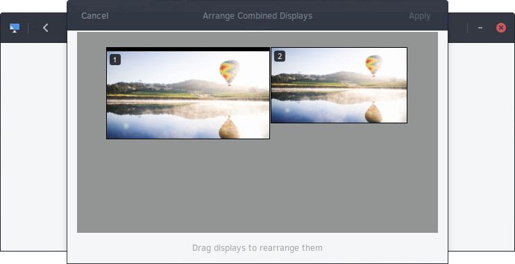

# Configuring Displays

You can configure your display(s) by going to the Budgie Menu, opening the Settings app, and clicking the Displays section.

You will then be shown the following window.

In this window, you can select individual displays to configure. Clicking on an item will show the following dialog.

This window will enable you to select if you wish to use this monitor as the primary or secondary display, mirror it with another display, or turn it off.

It also gives you size and aspect ratio, ability to rotate the display, and ability to change the resolution.

Going back to the Displays section, you also have the option to arrange your displays. Click the “Arrange Combined Displays” to be presented with the following window.

