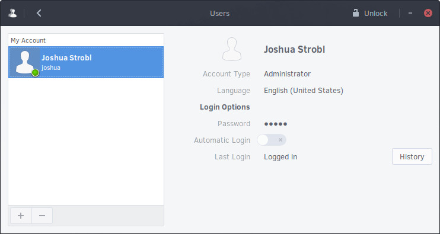
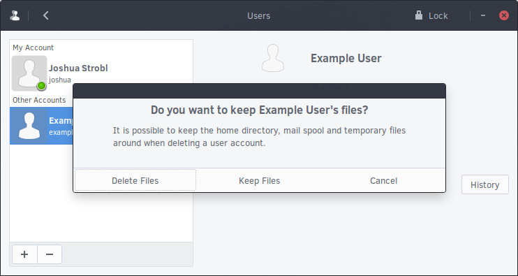

## Managing Users

To add and remove users on your Solus system, go to the Budgie Menu, open the Settings app, then go to Users.

*Your window should look fairly similar to the one below.*

To manage your or other’s accounts, you first need to authenticate. Click the Unlock button in the top right corner and type your password. Note that you are required to be an administrator. If you're the only user on 
the system, then your account is an administrator by default.

In the event it is correct, the Unlock button will change to Lock and the Add / Remove buttons will be clickable.

### Adding a User

To add a user, click the `+` button in the bottom left corner of the Users window. This will show the Add User window (shown below).

### Removing a user

To remove a user, select the user under the “Other Accounts” section and click the `-` button.

Upon clicking the remove the user, you will be brought to the following window. In this window, you have the option to keep their files, delete the files, or cancel the removal of the user’s account.

