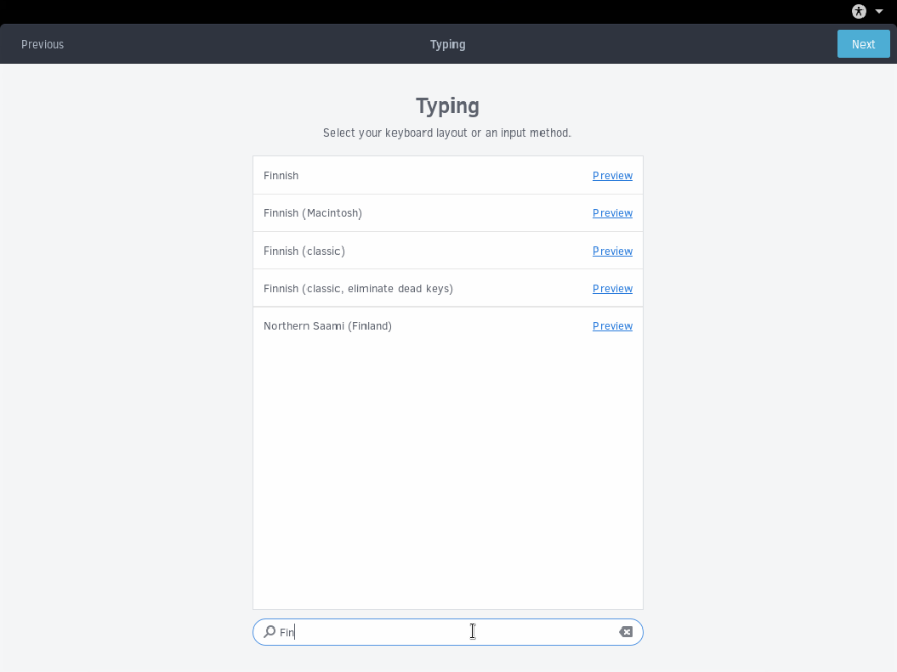

## Keyboard Layout

Select the language and layout for your keyboard. *You can change or add more later.*

If you do not find the correct keyboard layout, click the ⋮ button and type your language / keyboard layout like in the above image.

Upon finding and selecting the correct keyboard layout, click Next.