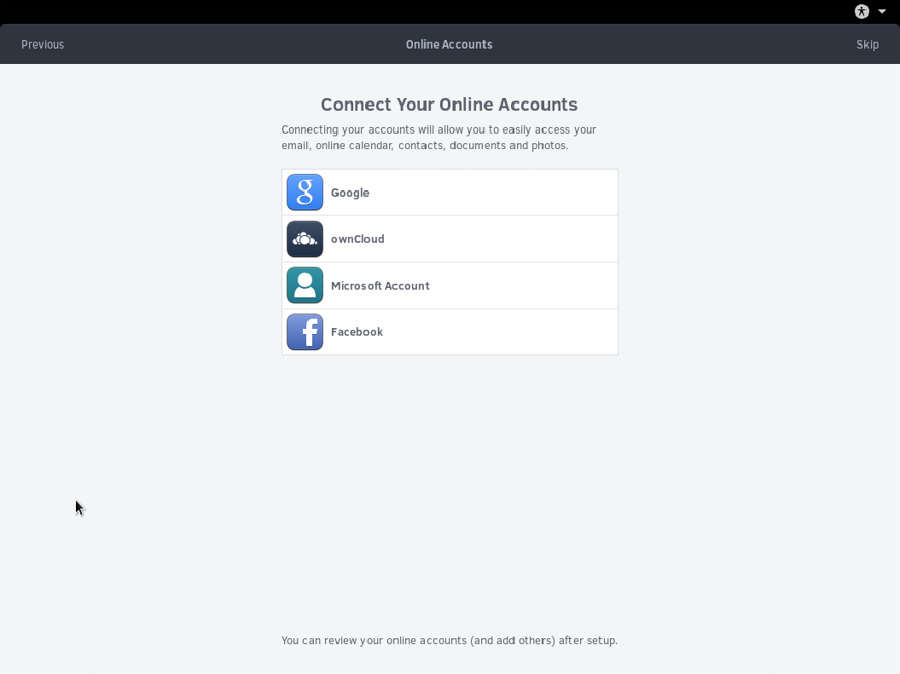

## Online Accounts

You have the option to connect your online accounts to easily access your calendar, contacts, documents, and more. This is an **optional** step and can always be done later via the Settings application.

In the interest of time, this guide will skip the Online Accounts creation. You can do as well by clicking the Skip button.