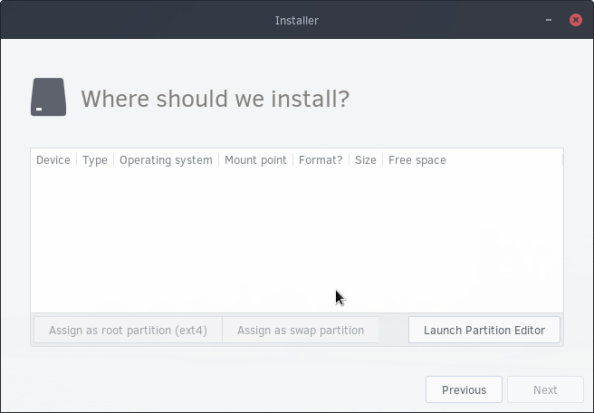
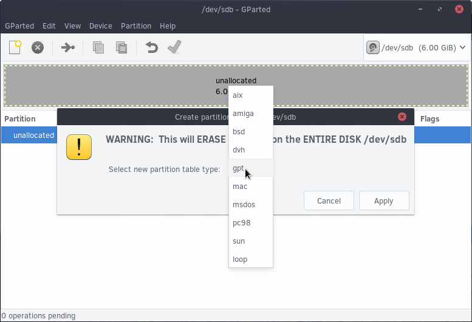
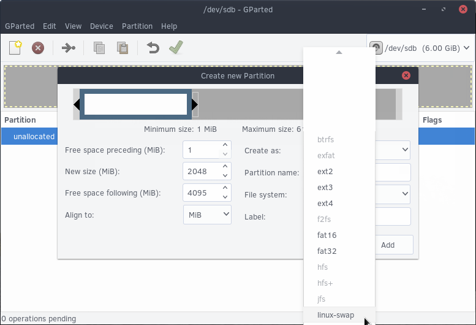
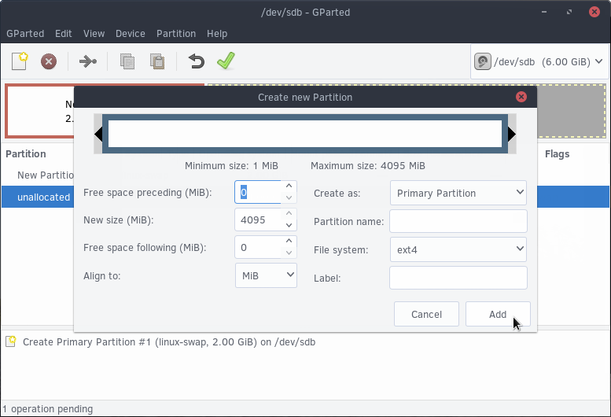
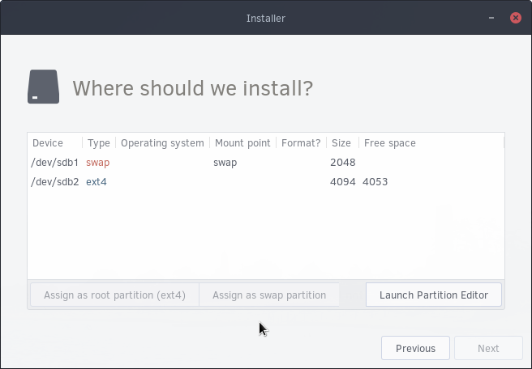

## Partitioning Your System

In this section, you will proceed to partition your system. This may mean the erasing of personal information on this system. If you are using a UEFI / EFI system, please follow the partitioning notes stated [here](https://wiki.solus-project.com/UEFI).


**Note:** The above screenshot reflects an empty drive. Your drive may appear differently.

### Configuring Partitions

The next step will be to select the drive you wish to install Solus to. After clicking the appropriate drive, you will come across our partition manager system. Now click Launch Partition Manager. This will launch a new window with a program called GParted.

If your device contains data / is **not** empty, skip this step. If your drive contains **no data**, click on Device menu, then Create Partition Table. Click the dropdown next to Select new partition table type and click **gpt**. Now click Apply.





Next, right click on the “unallocated” row in the partition table (below the graph) and click New.

This will bring you to the Create new Partition window, where we will first create Swap.

``` tinynote
What is Swap?
Swap is disk space that is used to contain application’s resources
in the event your system’s memory (RAM) is full.
```

We recommend a default of 2GB (2048 MiB) for swap. Type “2048” into the “New size (MiB) section. Now click the “File system” dropdown and press “linux-swap”. Proceed by pressing Add.



Right click the unallocated row again and proceed to click Add (*you will not need to change anything*).

Now click the big green check box to format the drive to the way you partitioned it. After it is done, it will say “All operations successfully completed”. Click close. Then close the GParted window.

### Assigning Partititions



You should now see a screen such as this, showing the new partitions.

First, click the **swap** device and click “Assign as swap partition”.

After doing so, click the **second device (ext4)** and click “Assign as root partition”. Remember the device prefix (in the image above, it is `/dev/sdb`) and click Next.