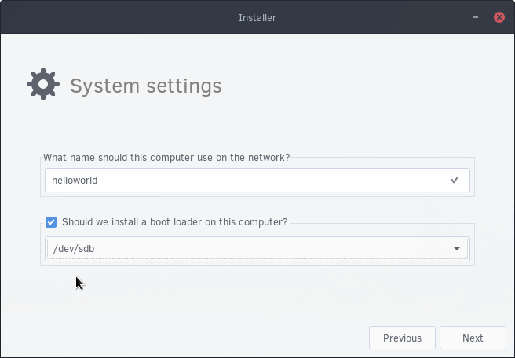

## System Settings and Bootloader

You will now come across a System settings section. This is where you type the name you wish to call your computer. Using the device from the preview screen (partitioning), click “Should we install a bootloader on this computer?” and then select that device.

Click next, review the Summary, then click Next if everything looks good!

It will now begin installation of Solus on your system! This may take some time.