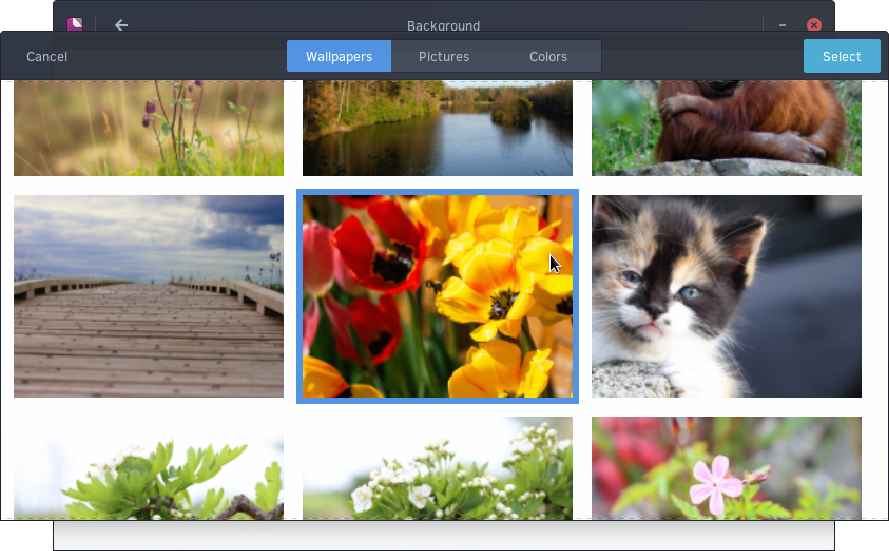

## Changing Background

You can change your background by going to the Budgie Menu, opening Settings, then clicking Background.

You will have two options, Background and Lock Screen. Select Background.

In this section, you can choose between predefined wallpapers,pictures in your Pictures folder, or solid colors. After choosing, click Select.