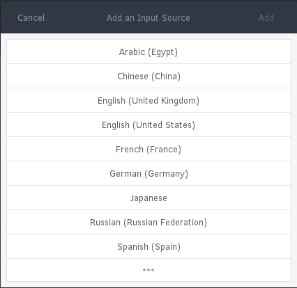
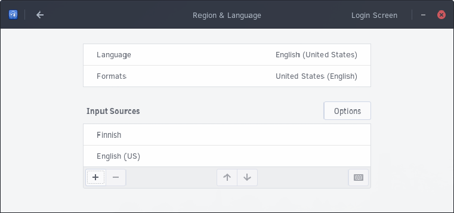

## Configuring Keyboard Layout

You can change your language by going to the Budgie Menu, opening Settings, then clicking Region and Language.

You will now be shown the following dialog.

Click the `+` button to add an input source (keyboard layout). You will be shown the following dialog.

Here, you can select the language and then keyboard layout within each language section. If it does not appear in this list, click the ⋮ button. This will enable you to search for the keyboard layout you wish to use.

After choosing the keyboard layout, click Done. You will be brought back to the following dialog with your new keyboard layout. In the image below, we are now using English (US) and Finnish layout.

You can remove a keyboard layout by click on one of the items, for instance Finnish, then clicking the `-` button.

If you wish to use multiple keyboard layouts, you can switch to them by using: `Windows key + Space`