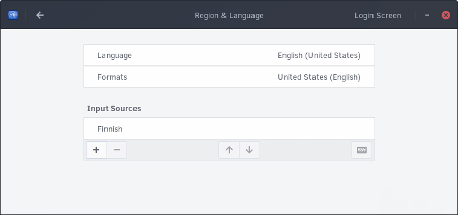
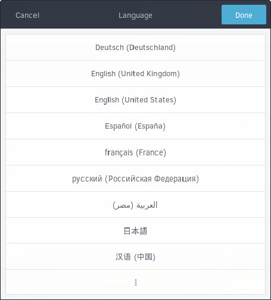
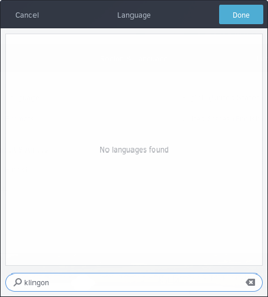

## Configuring Langauge

You can change your language by going to the Budgie Menu, opening Settings, then clicking Region and Language.

You will now be shown the following dialog.

In this dialog, click Language. The following dialog will appear.

Here, you can select the language you wish your system to use. If it does not appear in this list, click the ⋮ button.

You will come across the following dialog where you can type your language.

Select the language from the list and click Done. You **may** need to logout and login to your computer for it to take affect.