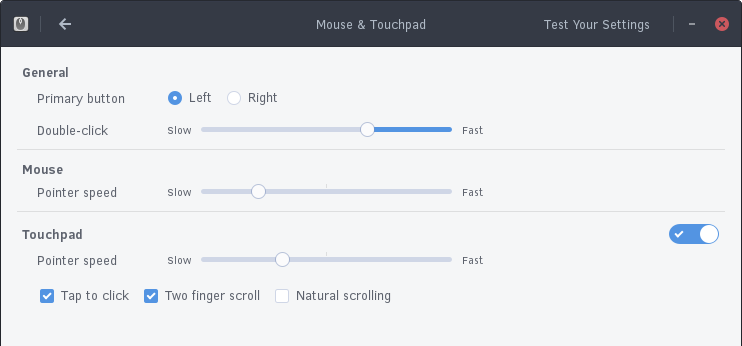

## Configuring Mouse and Touchpad

You can configure the settings of your mouse and/or touchpad by going to the Budgie Menu, opening the Settings app, then clicking the Mouse & Touchpad section. You will be presented with the following window.

In this window, you can set if you want your primary button (usually left click) to be left or right, speed of double-clicking, and individual pointer speeds for mouse and touchpad.

You can also toggle Tap to click (click via touchpad), two-finger scrolling, and “natural scrolling” (reversed scrolling directions).

You can also test your settings by clicking the Test Your Settings button in the top right of the window.