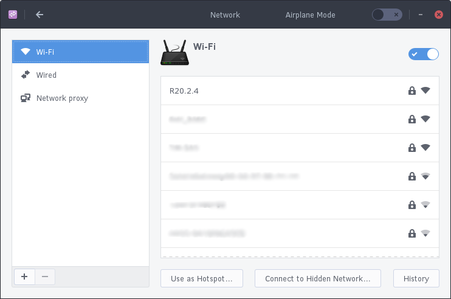
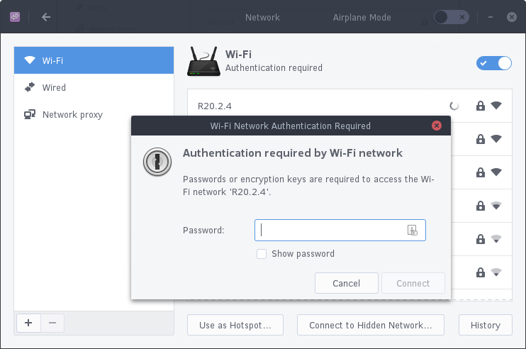
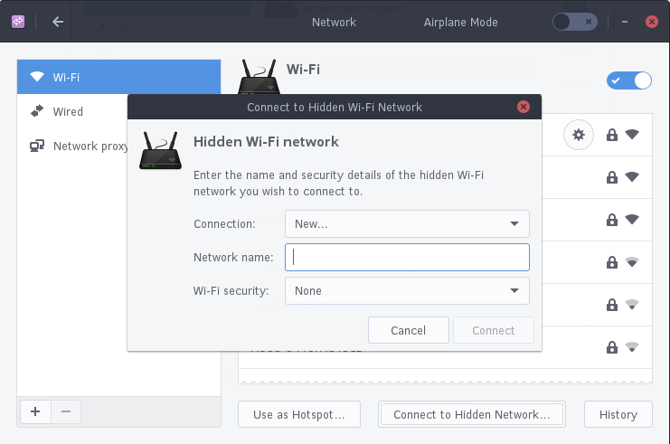

## Configuring Network

You can configure your network settings such as wireless networking, by going to the Budgie Menu, opening Settings, then clicking Network.

To configure wireless, go to the Wi-Fi section. If your wireless is currently turned off, click the toggle button, leave the Network section, and go back in.

### Non-Hidden Network

Click the access point you wish to connect to.

You may now be prompted to authenticate with the network. Type in your password and then click Connect.

If your password is correct, you will now be authenticated with the network.

### Hidden Network

If you wish to connect to a hidden network, click “Connect to Hidden Network”. It will show the following dialog, where you type the SSID (name of the network) and type of security (if any).

If the network is found and has a password, you will be prompted to authenticate with the network.