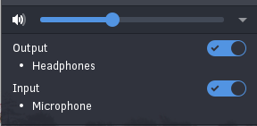
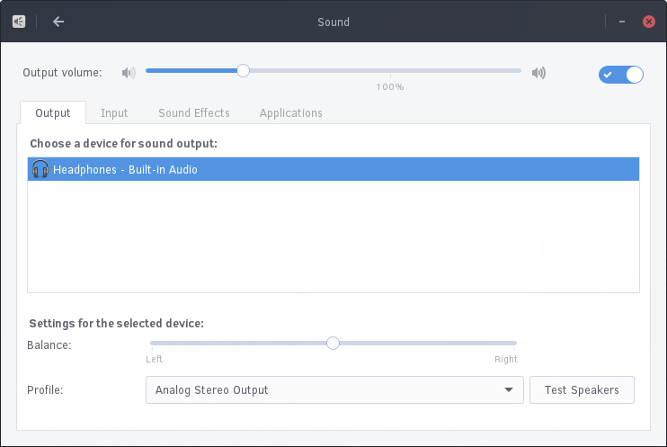

## Configuring Sound and Sound Devices

You can configure sound devices, change volume and enable / disable devices through two methods.

### Raven

` special-formatting: image-float-left`

` end-special-formatting `

You can access sound settings via the Sound applet in Raven. Please consult the Raven section of Using Desktop for information on access Raven.

### Settings

You can access further sound settings, including individual application volume controls, by going to the Budgie Menu, opening Settings, then clicking Sound.