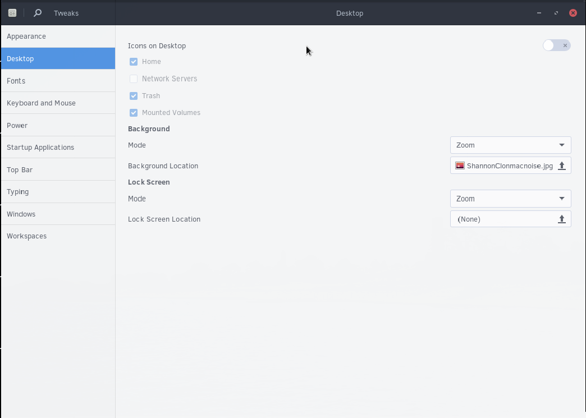
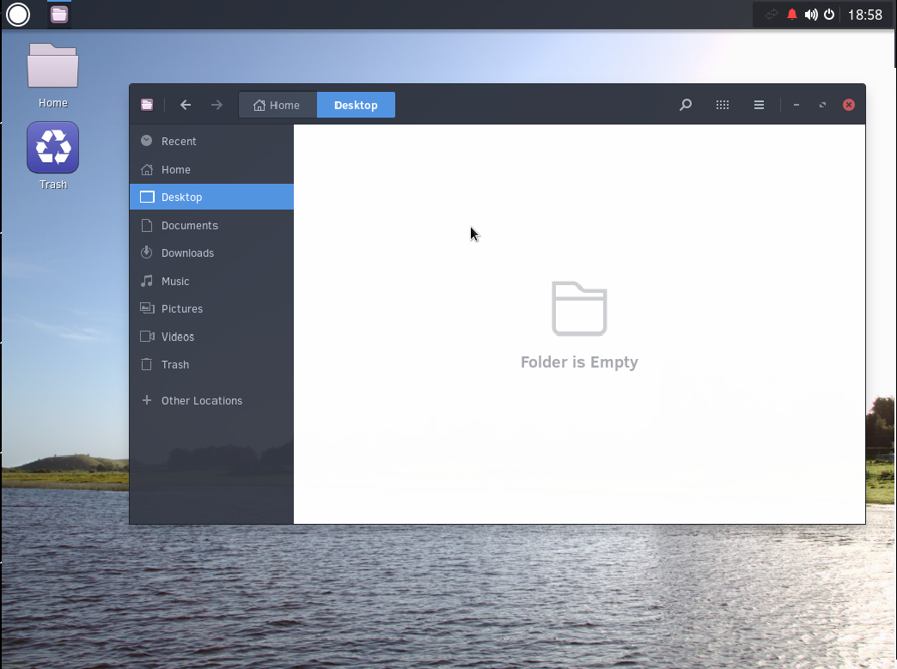

## Enabling Desktop Icons

You can enable desktop icons by going to the Budgie Menu and typing Tweak Tools. After opening Tweak Tools, go to the Desktop section.

From the desktop section, click the toggle button to the right of Icons on Desktop. You can also choose what is automatically shown on the desktop.

You may now add things to your Desktop by:
1. Opening the file manager
2. Moving the files you want to the Desktop folder (as shown in the image below).

