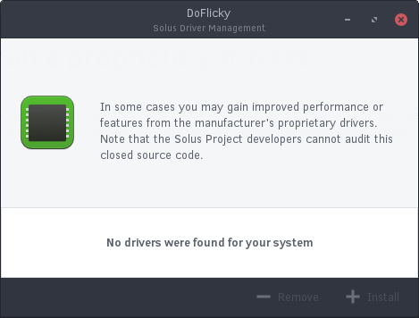

## Enabling Proprietary Drivers

Enabling proprietary drivers may improve performance or certain features, however they are usually not necessary for normal daily usage.

You can enable proprietary AMD and Nvidia drivers by going to the Budgie Menu and opening Hardware Drivers.

If there are proprietary drivers that can be installed, they will show up in the box below the description. You can click the item you wish to install and click Install. A reboot will be required to use the newly installed driver.