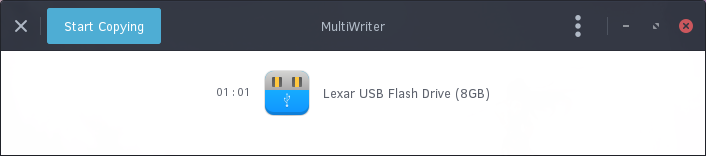
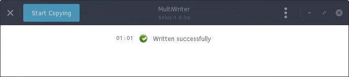
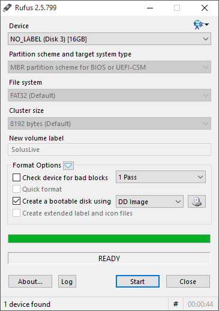

# Preparing to installation

## Getting the ISO

The first step to installing Solus is acquiring the correct media. The Solus Project provides ISO images, which contain the contents of the Solus Operating System for installing.

You can download a Solus ISO by going to our [Download page](https://solus-project.com/download). We recommend using the latest stable release of Solus, which is currently 1.0.

**Note**: If you are a supporter on our [Patreon](https://www.patreon.com/solus?ty=h), we provide early access to new builds and features. If obtaining access to new builds early interests you, as well as supporting development, support us on Patreon!

---

## Getting the Right Tool

There is a multitude of tools enable the writing of our ISO image to DVDs or USB thumb drives. Below, we break it apart across Linux and Windows.

## Linux

### DVD

We recommend using [Brasero](https://wiki.gnome.org/Apps/Brasero) for writing the ISO to a DVD.

### USB

#### Graphical Tool

We recommend using [Gnome Multi-Writer](https://wiki.gnome.org/Apps/MultiWriter). Please note that unetbootin will **not** work.

#### Command-Line

For those comfortable with the command-line / terminal, we will walk you through using `dd`.

## Windows

## DVD

You can easily burn an ISO image to a DVD, on Windows 7 and newer, by using Window's built-in file manager (Explorer), right-clicking on the ISO image file, and clicking Burn disk image.

## USB

You can easily burn an ISO image to a USB by using graphical tool [Rufus](https://rufus.akeo.ie/).

---

## Writing the ISO

To write the ISO, you will need:

1. Either a blank DVD or a USB drive larger than 1GB.
2. If using a USB, the ability to boot from the USB.
3. ISO from the Getting the ISO section

### Linux

#### DVD

1. Insert blank DVD (DVD-R or DVD+RW is suitable) into your DVD writer.
2. Open Brasero.
3. Select the option “Burn image”.
4. Click the “Click here to select a disc image” button and using the file dialog, choose the ISO.
5. Ensure the correct DVD is selected in the “Select a disc to write to”.
6. Click Burn and wait.
7. Upon seeing “Image successfully burned to DVD”, click Close.

#### USB

##### Graphical Tool

Upon opening Gnome MultiWriter, you will likely be shown a window similar to the one below, in the event your USB drive is already plugged in.



If your USB drive is not plugged, you will be prompted with an image indicating to plug it in.

Next, click the Start Copying button, and you will be prompted to select the ISO. Choose the ISO you downloaded in the Getting the ISO section. The USB will automatically be written to.


Upon completion, you will be prompted will the following dialog and your USB is now ready for use.



##### Command Line

Please follow the steps below, which guide you through installation using the utility `dd`:

First, insert your USB drive in your computer and open your Terminal. Proceed to type `lsblk` into your Terminal. It should output something along the lines of:

``` bash
NAME   MAJ:MIN RM   SIZE RO TYPE MOUNTPOINT
sda      8:0    0 111.8G  0 disk
├─sda1   8:1    0   350M  0 part
├─sda2   8:2    0  39.7G  0 part
└─sda3   8:3    0  71.8G  0 part /
sdb      8:64   1   7.5G  0 disk
├─sdb1   8:65   1   712M  0 part
└─sdb2   8:66   1  17.2M  0 part
```

You will see one disk, in my case `/dev/sdb`, that is roughly the size of my USB Drive. Yours should be similar (difference being in size). Write this device down somewhere.

Next, locate the downloaded ISO. It will most likely be in your Downloads folder. In the event that it is, type: `cd ~/Downloads`

If it is **not** in your Downloads folder, use `cd` to navigate to the correct step.

**Dangerous Below**

This is where we overwrite the contents of your USB drive so please ensure you identified the current drive in lsblk stage above. My command is below, however you may need to replace sdb with the drive we located above:

``` bash
sudo dd if=Solus-1.0.iso of=/dev/sdb bs=1M;sudo sync;sudo eject /dev/sdb
```

This will write the contents of the ISO to the thumb drive so you can boot it and also make sure the data is synchronised so you can eject the USB safely.

### Windows

#### DVD

1. Open Window's built-in file manager (Explorer).
2. Right click on the ISO image file and clicking Burn disk image.
3. Select the correct Disc burner.
4. Click Burn.

#### USB

1. Open Rufus.
2. Ensure your device is correct by checking the contents of the Device dropdown.
3. Click the CD icon found in the image below, and select the ISO.
4. Untick all options except "Create a bootable disk using" and use the dropdown to select "DD Image".
5. Click Start.



---

## Boot the Image

Now it is time to restart your computer to boot the DVD or ISO. Most computers will automatically boot from DVDs and USB, however if you experience issues booting the media, you may need to select to boot from DVD or ISO.

This is usually accessible by pressing `F9` or `F12` while your computer is booting. On some devices it may also be `ESC`.
