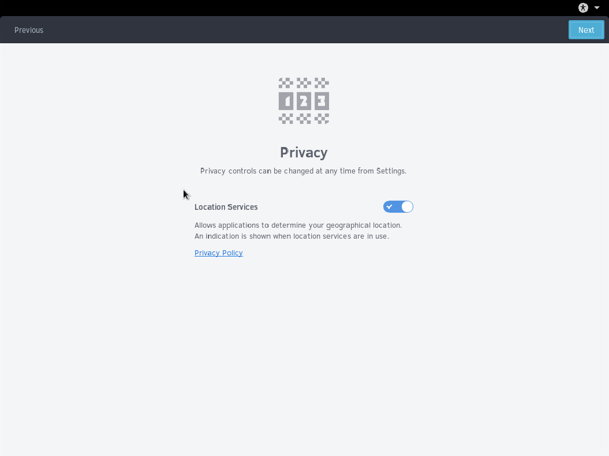

## Privacy



Next we arrive at the Privacy section. In this section, you have the option to disable Location Services. Location Services are used to determine your geographical location and are only used for specific applications.

``` tinynote
Solus Project does not store use any of the location information provided by the system.
Location Services is solely used by applications and provided by your desktop.
```

After keeping it the same or disabling Location Services, click Next.