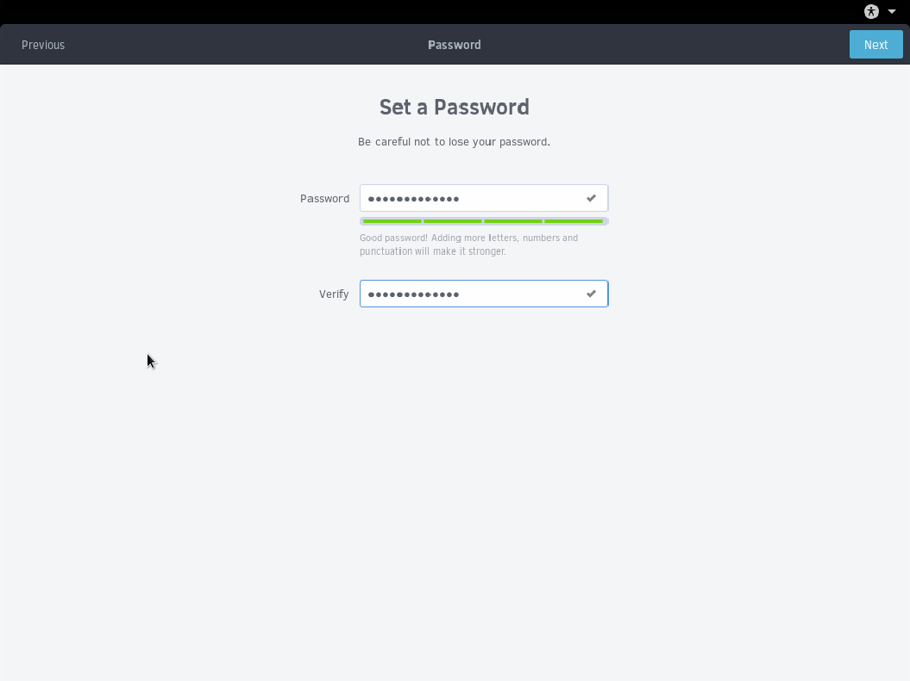

## Set a password

We are now entering a password to secure our user account created in the previous step.

We recommend using a strong password that is:

- 8 characters or more.
- A mix of lowercase, uppercase, and numbers.
- Optionally punctuation.

As your password gets strong, the green progress bar fills up. So long as one green section is filled and your passwords match, you can click Next. But you should have it be as strong as possible!