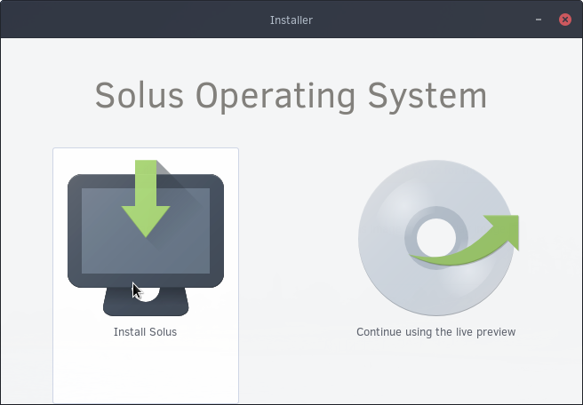

## Starting Installer

The first step to installing Solus is, naturally, starting the Installer. Click the down-arrow icon in the upper left corner of the screen, then proceed to click Install Solus.