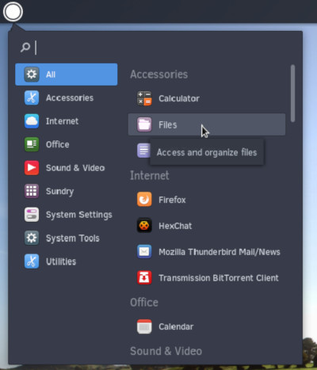
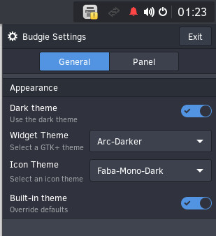
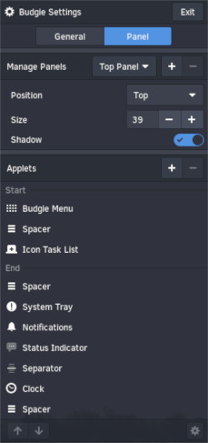

## About Budgie

Budgie is the flagship desktop environment of the Solus Operating System. It is designed with the modern user in mind, it focuses on simplicity and elegance, while being powerful and customizable enough to make it your own.

### Accessibility

Budgie has been tested and refined to ensure High Contrast theming works out-of-the-box and enabling usage by individuals with visual impairments.

### Budgie Menu

` special-formatting: image-float-left`

` end-special-formatting`

This menu enables quick access to your installed programs and offers category and compact views.

### Raven

` special-formatting: image-float-left`

` end-special-formatting`

Budgie ships with an applet, notification and customization center referred to as Raven. Raven enables you to:

1. Easily access calendar information, sound volume, media player controls, and more via Applets view.
2. Manage incoming application and system notifications via Notifications view
3. Customize your Budgie and system experience by enabling you to:
 1. Toggle system-wide Dark theme.
 2. Change GTK and icon theming
 3. Add, remove, and modify Budgie panels, their properties as well as their displayed applets.
4. Obtain quick access to system settings and power options such as restart, suspend, and shutdown.

You can access Raven by clicking the status icons (such as notification bell) in the top right corner of the screen or via the Keyboard Shortcut stated below.

### Keyboard Shortcuts

We provide numerous keyboard shortcuts to enable quick access to areas of the Budgie desktop.

Keyboard Shortcut | Action
----- | -----
Windows Key (*also Windows key + S*) | Open Budgie Menu
Windows Key + N | Open Raven

### Budgie Settings

` special-formatting: image-float-left`

` end-special-formatting`

You can customize your Budgie desktop experience via Raven. Click the cog wheel icon when you have Raven open.

In the Budgie Settings “General” section, you can choose to use a global Dark theme, “widget” theme, and icon theming.

` special-formatting: image-float-left`

` end-special-formatting`

In the Budgie Settings “Panel” section, you can choose:
- If you wish for the panel (where running applications, clock, etc. are shown) to be on the top or bottom of the screen
- How tall the panel is and whether it has a shadow.
- The positioning of individual “applets” (like the clock).
- Individual sections for applets (click on the Icon Task List applet as an example and see the cog wheel light up.)
 - Sometimes individual applets have further customization options! The Icon Task List enables you to enlarge the icons, for example.
