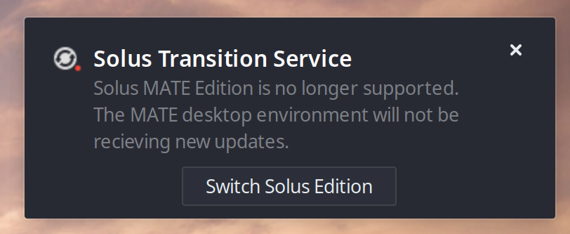
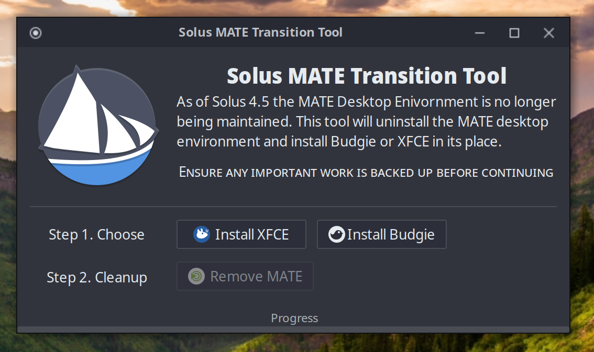

Back in our [4.4 release post](https://getsol.us/2023/07/08/solus-4-4-released/) we announced that Solus would stop shipping a MATE ISO, mostly because MATE showed no signs of moving away from X11 and towards wayland. At the beginning of this year, we shipped our new Xfce ISO as a beta. And now we're getting ready to ship the _Solus MATE Transition Tool_ to move existing users off of MATE.

<!-- truncate -->

## The problem

MATE and Xfce are similar enough that eager Solusians can, and have, installed XCFE on their MATE machines with nothing more than a couple of `eopkg` commands. We're pretty sure our resident `bash` script enthusiast (ermo) could hammer out a working transition script in an evening. But we want a more polished experience. We know _you_ follow Solus news; after all, you're reading this. However, we assume there are users who dutifully update their systems, but have no interest in keeping up with our blog posts. How do we get their attention and prompt them to move away from MATE?

## Introducing the Solus MATE Transition Tool

We're pleased to show off the _MATE Transition Tool_, which we plan to include in normal updates to MATE systems in the coming weeks. Most of the work on this tool was done by Joey; more on his efforts in the section below. Here's how MATE users will encounter the tool:

:::note

These screenshots are current as of the publishing of this post, we may change things as we continue testing.

:::

1. Users will get a notification on every start-up informing them that they need to transition away from MATE.

2. Clicking on that notification will launch the Solus MATE Transition Tool.

3. Users select either Solus Budgie or Solus Xfce. The tool installs the selected edition, removes MATE, and prompts for a reboot
4. The tool removes itself after a successful transition.

Simple. At least, that's what we want users to think.

## How the Mate Transition Tool is actually part of our Python2 work

The story of the MATE Transition Tool is actually tied up in our fight to drag `eopkg` into the current decade. As I wrote previously, we're somewhat embarrassed by the amount of Solus tooling which _still_ relies on Python2. One such tool is the Solus Software Center `solus-sc`. A while back, the team decided the sane thing to do was to ditch `solus-sc` in favor of _KDE Discover_ and _GNOME Software_ . This would have the additional benefit of promoting flatpak applications to first-class citizens. The problem is _Discover_ and _Software_ have no way to talk to our package manager `eopkg`. We need an API. Luckily, other projects have encountered the same issue, leading to [`packagekit`](https://www.freedesktop.org/software/PackageKit/pk-intro.html).

Joey has been doing the dirty work of bolting `packagekit` support onto `eopkg`, and saw an opportunity: If `eopkg` could be upgraded to understand some of `packagekit`, then he could write a special-purpose application to move users off MATE without asking them to run scary bash scripts (sorry ermo). We're rather pleased with this solution. MATE users get a simple transition and Solus gets closer to checking `solus-sc` off [the list.](https://github.com/getsolus/packages/issues/270)
