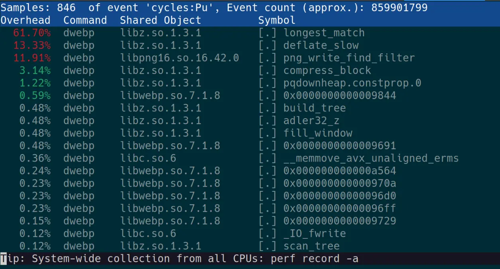

We'll explore how to build packages with advanced compiler techniques in order to squeeze more performance out of the box for packages in Solus. We'll be using the story of how `libwebp` was optimized for and how it led to an unexpected side quest.

<!-- truncate -->
<!-- cspell:disable-next-line -->

# Cual es la causa

Linux distributions have a lot of control over how a source-based package gets compiled and shipped to users as part of a binary repository. Aggressive and advanced compiler optimization techniques, as well as other methods can be used to provide greater out of the box performance for end users. This can greatly benefit users running on older hardware to provide a snappier end-user experience; reducing time waiting on a heavy workload to finish; or even improved battery life; amongst other improvements.

Part of the problem is, a packager's time is limited. So how, as a distribution, do you choose to try provide faster compatible packages for an end user. A historic approach is to simply change the default compiler flags for _all_ packages, such as enabling [LTO](https://en.wikipedia.org/wiki/Interprocedural_optimization) by default. Whilst this approach can work well, at Solus the philosophy is slightly different where a packager can trivially enable several advanced compiler optimization techniques such as [PGO](https://en.wikipedia.org/wiki/Profile-guided_optimization) without too much faffing around on a _targeted_ package.

The benefits of such an approach are:

- Can target the performance of a specific package to benefit _all_ users
- A compiler optimization may improve one package, but may not apply globally to all packages.

The downsides are such:

- Requires additional packager time to benchmark and experiment with different optimization strategies.
- Requires the packager to _choose_ and invest time into improving performance of a package.
- Requires the packager to find an appropriate benchmark to test the package against.
- Experimenting with compiler optimizations may not bear fruit: no meaningful improvement in performance, or there may be some other bottleneck.

# Optimization Techniques Available

- speed:
  - As simple as it gets really, build a package with `-O3` instead of `-O2` as well as any other flags deemed worthy to be included as part of the `speed` flags. The main drawback of this is that `-O3` is not guaranteed to produce faster results than building with `-O2` and typically will produce bigger binaries. The days of `-O3` outright breaking your program in weird unexpected ways is largely behind us.
- LTO:
  - Compared to some other distributions `-flto` is not yet enabled by default on Solus. LTO is almost guaranteed to provide a %1 or slightly larger performance improvement as well as a smaller binary at the cost of increased compiling times and memory usage during build. When combined with other optimization techniques such as PGO the LTO optimization can really stretch its legs and provide even greater uplift!
- Clang:
  - Not strictly an optimization, but, building a package with `clang` instead of `gcc` and `ld.ldd` to link instead of the infamous `ld.bfd` may provide a faster package out of the box. You'll have to be careful of subtle ABI differences if building with `clang`. If in doubt, and, `clang` is the obvious choice, perform safety rebuilds on all reverse dependencies of the package.
- PGO:
  - Profile guided optimization. Build once with instrumentation in order to collect profile data when ran. Run the program using a representative workload in order to collect profiling data. Build the program again with the profiling data provided in order to build an optimized variant.
- BOLT:
  - Binary optimization and layout tool. You can think of this as "post-link PGO" where you instrument a binary with `bolt` to collect profiling data. Run that binary. Then finally reorganize the binary layout using the collected profile data. This generally works better on large statically linked binaries but smaller binaries or libraries such as found in a typical package can benefit too. This optimization is still quite new.

Regardless, that's enough word spaghetti, let's look at the process to actually optimize a package.

# Optimizing a Package

Right, to begin with we'll have to start on choosing an actual package to benchmark and optimize. I've heard the `.webp` file format is becoming increasingly common on the web, slowly replacing `.png` and `.jpg` file formats due to the strong backing of Google (for better or for worst). An improvement in decoding time for `.webp` files would benefit any user using a web browser casually browsing the web.

Let's have a look at the `package.yml` build recipe for `libwebp`.

<!-- prettier-ignore -->
```yaml
name       : libwebp
version    : 1.3.2
release    : 25
source     :
    - https://github.com/webmproject/libwebp/archive/refs/tags/v1.3.2.tar.gz : c2c2f521fa468e3c5949ab698c2da410f5dce1c5e99f5ad9e70e0e8446b86505
homepage   : https://developers.google.com/speed/webp/
license    : BSD-3-Clause
component  : multimedia.codecs
summary    : A new image format for the web
description: |
    WebP is a new image format that provides lossless and lossy compression for images on the web. WebP lossless images are 26% smaller in size compared to PNGs. WebP lossy images are 25-34% smaller in size compared to JPEG images at equivalent SSIM index. WebP supports lossless transparency (also known as alpha channel) with just 22% additional bytes. Transparency is also supported with lossy compression and typically provides 3x smaller file sizes compared to PNG when lossy compression is acceptable for the red/green/blue color channels.
emul32     : yes
patterns   :
    - devel : /usr/share/man
builddeps  :
    - pkgconfig32(glu)
    - pkgconfig32(glut)
    - pkgconfig32(libpng)
    - pkgconfig32(libtiff-4)
    - pkgconfig32(libturbojpeg)
    - pkgconfig32(zlib)
    - giflib-devel
setup      : |
    %reconfigure --disable-static --enable-everything
build      : |
    %make
install    : |
    %make_install
```

Okay, looks to be a quite simple affair. A simple configure, make, make install as well as `emul32` being enabled specifying the -32bit packages are also provided from this recipe. Next step is to look for a repeatable and easy way to benchmark it. We'll begin by looking at the `pspec_x86_64.xml` file which lists all the files produced from the `package.yml` recipe as well as some metadata.

```xml
        <Name>libwebp</Name>
        <Summary xml:lang="en">A new image format for the web</Summary>
        <Description xml:lang="en">WebP is a new image format that provides lossless and lossy compression for images on the web. WebP lossless images are 26% smaller in size compared to PNGs. WebP lossy images are 25-34% smaller in size compared to JPEG images at equivalent SSIM index. WebP supports lossless transparency (also known as alpha channel) with just 22% additional bytes. Transparency is also supported with lossy compression and typically provides 3x smaller file sizes compared to PNG when lossy compression is acceptable for the red/green/blue color channels.
</Description>
        <PartOf>multimedia.codecs</PartOf>
        <Files>
            <Path fileType="executable">/usr/bin/cwebp</Path>
            <Path fileType="executable">/usr/bin/dwebp</Path>
            <Path fileType="executable">/usr/bin/gif2webp</Path>
            <Path fileType="executable">/usr/bin/img2webp</Path>
            <Path fileType="executable">/usr/bin/vwebp</Path>
            <Path fileType="executable">/usr/bin/webpinfo</Path>
            <Path fileType="executable">/usr/bin/webpmux</Path>
```

Perfect, we have `dwebp` and `cwebp` binaries available in the main package, which from a guess can be used to decode and encode `.webp` files. Let's try it out.

```
$ dwebp -h
Usage: dwebp in_file [options] [-o out_file]

Decodes the WebP image file to PNG format [Default].
Note: Animated WebP files are not supported.
$ cwebp -h
Usage:

   cwebp [options] -q quality input.png -o output.webp
```

Awesome, these binaries do exactly what we need to benchmark `libwebp`, but, we are also indirectly testing `libpng` as well for this benchmark, we'll have to keep an eye out for that.

One extra step we have to do is ensure these binaries are actually linking against their own library, as upstream developers can have a habit of making sure their binaries don't link against their own libraries and end up being self-contained. Run `ldd` to verify.

<!-- spellchecker:disable -->

```
$ ldd /usr/bin/dwebp
	linux-vdso.so.1 (0x00007ffed8733000)
	libwebpdemux.so.2 => /usr/lib/libwebpdemux.so.2.0.14 (0x00007f7473bb4000)
	libwebp.so.7 => /usr/lib/libwebp.so.7.1.8 (0x00007f7473ae2000)
	libpng16.so.16 => /usr/lib/libpng16.so.16 (0x00007f7473aa6000)
	libc.so.6 => /usr/lib/glibc-hwcaps/x86-64-v3/libc.so.6 (0x00007f74738a9000)
	libsharpyuv.so.0 => /usr/lib/libsharpyuv.so.0.0.1 (0x00007f747389e000)
	libm.so.6 => /usr/lib/glibc-hwcaps/x86-64-v3/libm.so.6 (0x00007f74737b8000)
	libz.so.1 => /usr/lib/libz.so.1.3.0 (0x00007f7473200000)
	/usr/lib64/ld-linux-x86-64.so.2 (0x00007f7473bea000)
```

<!-- spellchecker:enable -->

Awesome in this case both `dwebp` and `cwebp` link against `libwebp.so` so we can be confident that any performance improvements will be applicable to all packages in the repository linking against `libwebp`.

Let's grab a couple of `.webp` files from [here](https://developers.google.com/speed/webp/gallery1) to test with. We'll just use the largest image size available in this case to reduce noise as much as possible when running benchmarks as well as allow any potential optimizations to stretch their legs a little more.

Now having done the prep work, lets actually benchmark the damn thing using `hyperfine` for the time being.

```
$ hyperfine "dwebp ~/3.webp -o /dev/null"
Benchmark 1: dwebp ~/3.webp -o /dev/null
  Time (mean ± σ):     202.2 ms ±   0.3 ms    [User: 198.9 ms, System: 3.0 ms]
  Range (min … max):   201.8 ms … 202.7 ms    14 runs
$ hyperfine "cwebp ~/PNG_Test.png -o /dev/null"
Benchmark 1: cwebp ~/PNG_Test.png -o /dev/null
  Time (mean ± σ):      1.423 s ±  0.009 s    [User: 1.346 s, System: 0.076 s]
  Range (min … max):    1.410 s …  1.435 s    10 runs
```

There, we have our a basic baseline for encode and decode performance. We mostly care about decode performance here but improved encoding performance would also not go amiss.

## Let's Start Obvious

Let's start basic, enabling the `speed` optimization which basically builds with `-O3` instead of `-O2` as well as any other flags that are deemed to be worthy to be part of the `speed` group. As well as, the `lto` optimization which builds with link time optimization allowing for inter-procedural optimizations to take place.

<!-- prettier-ignore -->
```yaml
optimize:
    - speed
    - lto
```

Moment of truth...

```
$ hyperfine "dwebp ~/3.webp -o /dev/null"
Benchmark 1: dwebp ~/3.webp -o /dev/null
  Time (mean ± σ):     200.0 ms ±   1.5 ms    [User: 197.3 ms, System: 2.5 ms]
  Range (min … max):   198.1 ms … 203.2 ms    15 runs
$ hyperfine "cwebp ~/PNG_Test.png -o /dev/null"
Benchmark 1: cwebp ~/PNG_Test.png -o /dev/null
  Time (mean ± σ):      1.353 s ±  0.012 s    [User: 1.281 s, System: 0.071 s]
  Range (min … max):    1.336 s …  1.369 s    10 runs
```

Well okay, we got a very minor uplift in decoding performance and a slightly higher improvement in encoding performance, but nothing too much to write home about. Luckily we have several more optimizations to explore...

## PGO is great, except, when it isn't.

Next step is to explore PGO (Profile Guided Optimization). For our `libwebp` package, looks like we already hit a bit of a snafu. There's no test suite included in the tarball! That's a bit of a disappointment as a test suite such as `make check` is by far and away the easiest and most comprehensive workload that can be used for profiling as part of PGO, especially for smaller libraries. However, we can still experiment with the just built `dwebp` and `cwebp` binaries as a suitable workload for PGO.

Luckily, as part of the package.yml format all you have to do is provide a profile for automatic PGO. After chrooting into the build environment and fiddling around a bit we end up with:

<!-- prettier-ignore -->
```yaml
profile    : |
    ./examples/dwebp webp_js/test_webp_js.webp -o test_png.png
    ./examples/cwebp test_png.png -o /dev/null
```

After specifying that, 6 builds will now be performed instead of 2:

- emul32:
  - Instrumented build
  - Run profiling workload
  - Optimized build using profiling data
- x86_64:
  - Instrumented build
  - Run profiling workload
  - Optimized build using profiling data

For this relatively small package it increases the build time from 1m1.672s to 1m42.199s

The next moment of truth...

```
$ hyperfine "dwebp ~/3.webp -o /dev/null"
Benchmark 1: dwebp ~/3.webp -o /dev/null
  Time (mean ± σ):     204.1 ms ±   2.2 ms    [User: 201.3 ms, System: 2.7 ms]
  Range (min … max):   201.6 ms … 207.1 ms    14 runs
$ hyperfine "cwebp ~/PNG_Test.png -o /dev/null"
Benchmark 1: cwebp ~/PNG_Test.png -o /dev/null
  Time (mean ± σ):      1.349 s ±  0.010 s    [User: 1.266 s, System: 0.082 s]
  Range (min … max):    1.335 s …  1.374 s    10 runs
```

Well... That's interesting. We actually regress in performance for decode performance whilst gaining another small bump in encoding performance. Worse still, we get a bunch of `profile count data file not found [-Wmissing-profile]` warning messages during the optimized build indicating to us our profiling workload isn't comprehensive enough and doesn't cover enough code paths. The lack of a handy `make check` that could be used as a profiling workload is really hurting us here. For now, let's put a pin in exploring PGO, it isn't a dead end but more work needs to be done curating a more comprehensive workload to chuck at it in this particular case, whilst other, easier, optimization techniques are still available to us.

<!-- cspell:disable-next-line -->

## 256 Vector Units go brrrrrr...

The next obvious step is to explore `glibc` hardware capabilities. For those unaware both `clang` and `gnu` compilers provide `x86_64-v2`, `x86_64-v3` and `x86_64-v4` micro-architecture build options on top of the baseline of `x86_64`. These enable the use of targeting additional CPU instruction sets during compilation for better performance. For example, `-sse4.2` for `x86_64-v2`, `-avx2` for `x86_64-v3`, and `-avx512` for `x86_64-v4`.

Whilst that's great 'n all, if a program is built with `x86_64-v3` and gains an additional ~10% uplift in performance, it's no good if a `x86_64-v2` compatible cpu can't run it. Luckily the `glibc` loader that's found on almost general purpose linux installs provides a way to load higher or lower micro-architecture libraries if they're installed and supported.

On top of all that, the `package.yml` format provides an incredibly simple way of providing `x86_64-v3` built libraries by enabling the `avx2 : yes` flag.

With `avx2 : yes` enabled in the `libwebp` package three builds are performed.

- emul32
- x86_64-v3
- x86_64

We now see these additional files in the `pspec_x86_64.xml` file

```diff
+            <Path fileType="library">/usr/lib64/glibc-hwcaps/x86-64-v3/libsharpyuv.so.0</Path>
+            <Path fileType="library">/usr/lib64/glibc-hwcaps/x86-64-v3/libsharpyuv.so.0.0.1</Path>
+            <Path fileType="library">/usr/lib64/glibc-hwcaps/x86-64-v3/libwebp.so.7</Path>
+            <Path fileType="library">/usr/lib64/glibc-hwcaps/x86-64-v3/libwebp.so.7.1.8</Path>
+            <Path fileType="library">/usr/lib64/glibc-hwcaps/x86-64-v3/libwebpdecoder.so.3</Path>
+            <Path fileType="library">/usr/lib64/glibc-hwcaps/x86-64-v3/libwebpdecoder.so.3.1.8</Path>
+            <Path fileType="library">/usr/lib64/glibc-hwcaps/x86-64-v3/libwebpdemux.so.2</Path>
+            <Path fileType="library">/usr/lib64/glibc-hwcaps/x86-64-v3/libwebpdemux.so.2.0.14</Path>
+            <Path fileType="library">/usr/lib64/glibc-hwcaps/x86-64-v3/libwebpmux.so.3</Path>
+            <Path fileType="library">/usr/lib64/glibc-hwcaps/x86-64-v3/libwebpmux.so.3.0.13</Path>
```

Let's rerun `lld` on `dwebp` after installing the new package and...

<!-- spellchecker:disable -->

```
$ ldd /usr/bin/dwebp
	linux-vdso.so.1 (0x00007ffeab5b1000)
	libwebpdemux.so.2 => /usr/lib/glibc-hwcaps/x86-64-v3/libwebpdemux.so.2.0.14 (0x00007f9a351d5000)
	libwebp.so.7 => /usr/lib/glibc-hwcaps/x86-64-v3/libwebp.so.7.1.8 (0x00007f9a3510b000)
	libpng16.so.16 => /usr/lib/libpng16.so.16 (0x00007f9a350cf000)
	libc.so.6 => /usr/lib/glibc-hwcaps/x86-64-v3/libc.so.6 (0x00007f9a34ed2000)
	libsharpyuv.so.0 => /usr/lib/glibc-hwcaps/x86-64-v3/libsharpyuv.so.0.0.1 (0x00007f9a34ec1000)
	libm.so.6 => /usr/lib/glibc-hwcaps/x86-64-v3/libm.so.6 (0x00007f9a34ddb000)
	libz.so.1 => /usr/lib/glibc-hwcaps/x86-64-v3/libz.so.1.3 (0x00007f9a34dbb000)
	/usr/lib64/ld-linux-x86-64.so.2 (0x00007f9a3520b000)
```

<!-- spellchecker:enable -->

We can crucially see that `dwebp` is now loading the `x86-64-v3` built `libwebp.so` lib from `/usr/lib/glibc-hwcaps/x86-64-v3/libwebp.so.7.1.8`, success! Let's what our performance looks like.

```
$ hyperfine "dwebp ~/3.webp -o /dev/null"
Benchmark 1: dwebp ~/3.webp -o /dev/null
  Time (mean ± σ):     198.2 ms ±   1.2 ms    [User: 195.4 ms, System: 2.5 ms]
  Range (min … max):   197.0 ms … 200.5 ms    14 runs
$ hyperfine "cwebp ~/PNG_Test.png -o /dev/null"
Benchmark 1: cwebp ~/PNG_Test.png -o /dev/null
  Time (mean ± σ):      1.313 s ±  0.009 s    [User: 1.243 s, System: 0.078 s]
  Range (min … max):    1.308 s …  1.341 s    10 runs
```

Let's recap so far:

| Optimization            | Decode             | Encode  | Size    |
| ----------------------- | ------------------ | ------- | ------- |
| Baseline                | 202.2 ms           | 1.399 s | 1.33 MB |
| Speed + LTO             | 200.0 ms           | 1.353 s | 1.73 MB |
| Speed + LTO + PGO       | 204.1 ms :warning: | 1.349 s | 1.07 MB |
| Speed + LTO + x86_64-v3 | 198.2 ms           | 1.313 s | 3.17 MB |

Whilst we're still getting an additional speedup it isn't really anything to write home about. A measly ~2% improvement in decoding performance and a fairly respectable ~7% improvement in encoding performance for our test case. However, increasing the package size by an extra ~2MiB from providing a bunch of extra libs in `/usr/lib/glibc-hwcaps/x86-64-v3/` just ain't worth it. This hints that either the compiler optimizations aren't really effective here or we're being bottle-necked by something else.

So far, we've been benchmarking fairly simply using `hyperfine`, let's swap that out for `perf` so we can get a callgraph.

## Something about `perf` to the rescue

`perf record -o dwebp.data -- dwebp ~/3.webp -o /dev/null`

`perf record -o cwebp.data -- cwebp ~/PNG_Test.png -o /dev/null`

Let's look at `dwebp` first with `perf report -i dwebp.data`.



Well god damn, literally all of our time is being spent in `libz.so` it's no wonder our compiler optimizations were hardly improving performance.

Let's also look at the `cwebp` report, we've generally been getting better results from it.


Okay, much more of our time is being spent in `libwebp.so` itself here which helps to explain why we were seeing a better performance uplift. Still 5.68% of our time is being spent in `libz`.

## Choosing Wisely

You may remember early on, when I said we are also indirectly testing `libpng`. Well... after some more digging, that's exactly what's happening here. Re-running the `dwebp` binary it says this

> Decodes the WebP image file to PNG format

Turns out, it's more accurate to say we are _directly_ testing `libpng` and by extension `zlib`. It isn't `libwebp` that's spending all of its time in `libz.so`, it's `libpng`! This is exactly the reason you have to be careful about the benchmarks chosen and, ensure you understand what they're doing.

However, the good news about this little snafu is:

1. `dwebp` can be used to translate to another image format such as `.yuv` that'll more accurately remove the bottleneck from `libz.so`.
2. We now know that `libpng` has a huge bottleneck in `libz.so` and speeding up `zlib` _should_ dramatically speed up `libpng` performance.

## Adjusting the Benchmark

After reverting the `libwebp` package to the baseline let's use our adjusted decoding benchmark.

We'll now use `dwebp ~/3.webp -yuv -o /dev/null` for a decoding test, let's run that with `perf` to ensure we're exclusively testing `libwebp.so` here.


Okay that's awesome, no `libpng.so` or `libz.so` to mess with our tests!

Let's reapply our optimizations, keeping those which apply an uplift

| Optimization            | Decode            | Size    |
| ----------------------- | ----------------- | ------- |
| Baseline                | 14.7 ms           | 1.33 MB |
| Speed                   | 14.5 ms           | 1.56 MB |
| LTO                     | 14.6 ms           | 1.40 MB |
| PGO                     | 18.0 ms :warning: | 1.07 MB |
| x86-64-v3               | 12.7 ms           | 2.35 MB |
| Speed + LTO + x86-64-v3 | 12.3 ms           | 3.17 MB |

Okay, this is great, whilst we aren't getting much from speed or LTO, we are getting a big uplift from x86-64-v3 libraries and when combined with the other optimizations we're getting an uplift in performance of around ~16% at the cost of close to thrice the installed package size.

### Partial Profiling

Once again we see that PGO regresses performance hard, however, that smaller size is giving a good hint! We already know that the profiling workload we gave it isn't very comprehensive due to the bunch of `-Wmissing-profile` warnings we get during the optimized build. By default, PGO will aggressively inline and apply additional optimizations to code that's part of the profiling workload while everything else will be optimized for size. The idea being, hot-path code is fast and code that doesn't matter is small. However, what happens when you can't craft a comprehensive workload, as seems to be the case here? Luckily GCC has a flag for exactly that `-fprofile-partial-training`. GCC docs state that:

> In some cases it is not practical to train all possible hot paths in the program. (For example, program may contain functions specific for a given hardware and training may not cover all hardware configurations program is run on.) With -fprofile-partial-training profile feedback will be ignored for all functions not executed during the train run leading them to be optimized as if they were compiled without profile feedback. This leads to better performance when train run is not representative but also leads to significantly bigger code.

Okay, let's try it out, all we need to do is specify in our `package.yml` recipe.

<!-- prettier-ignore -->
```yaml
environment: |
    if [[ -n ${PGO_USE_BUILD} ]]; then
        export CFLAGS="${CFLAGS} -fprofile-partial-training"
        export CXXFLAGS="${CXXFLAGS} -fprofile-partial-training"
    fi
```

And the results:

| Optimization                          | Decode  | Size    |
| ------------------------------------- | ------- | ------- |
| Speed + LTO + x86-64-v3               | 12.3 ms | 3.17 MB |
| Speed + LTO + x86-64-v3 + Partial PGO | 12.5 ms | 3.13 MB |

Well, it was worth a try. This highlights how useless PGO can be when you don't or can't provide it a good workload. Interestingly, we don't get the size bloat that was promised, in fact, the opposite.

# Final libwebp Results

| Benchmark                           | Time Before | Time After | Size Before | Size After |
| ----------------------------------- | ----------- | ---------- | ----------- | ---------- |
| "dwebp ~/3.webp -yuv -o /dev/null"  | 14.5 ms     | 12.3 ms    | 1.33 MB     | 3.17 MB    |
| "cwebp ~/PNG_Test.png -o /dev/null" | 1.399 s     | 1.313 s    | --          | --         |

In the end, we get a very healthy ~16% improvement in decoding from a .webp to .yuv file. As well as a respectable 6% improvement in encoding from a .png to .webp file. However, the increased package size is very unfortunate. It's possible to tweak the x86-64-v3 build and only ship the libs that actually improve performance in order to get the installed size back to an acceptable level.

# "Next-Generation" Side Quest

Now, you probably remember earlier due to our unrepresentative benchmark we found out that `libpng` is getting highly bottlenecked by `libz.so`. This now seems like a perfect opportunity to take a look at zlib and circle-back to our original benchmark that we were using.

Zlib is widely employed throughout the ecosystem and, as such you'd think it would be highly-optimized for performance. However, that isn't really the case. Zlib is written in an old-fashioned way of C and tries to be _extremely_ portable; supporting dozens of systems that have fallen out of common use. As such, it's hard to apply architecture specific optimizations that wouldn't break some old system or without introducing code spaghetti. There have been a couple of attempts to merge AArch64 and x86_64 optimizations into the canonical zlib library without success.

However, there is some light in this tunnel as various forks of zlib having been popping up, applying new optimizations on top of zlib. The most promising of these looks be to [zlib-ng](https://github.com/zlib-ng/zlib-ng/). When built in compatible mode, it promises to be API compatible with canonical zlib and _tries_ to be as ABI compatible as possible.

Let's just go for it, replacing Solus' `zlib` package with zlib-ng built in compatible mode. It's a bit scary due to how integral zlib is in a typical Linux install, but, how hard could it be?

<!-- cspell:disable-next-line -->

## I Zee a Purty lil' Package

Well that was simple. Here's what our zlib-ng `package.yml` recipe looks like.

<!-- spellchecker:disable -->
<!-- prettier-ignore -->
```yaml
name       : zlib
version    : 2.1.5
release    : 28
source     :
    - https://github.com/zlib-ng/zlib-ng/archive/refs/tags/2.1.5.tar.gz : 3f6576971397b379d4205ae5451ff5a68edf6c103b2f03c4188ed7075fbb5f04
homepage   : https://github.com/zlib-ng/zlib-ng
license    : ZLIB
component  : system.base
summary    : zlib replacement with optimizations for next generation systems.
description:
    - A zlib data compression library for the next generation systems. ABI/API compatible mode.
devel      : yes
emul32     : yes
setup      : |
    %cmake_ninja \
        -DZLIB_COMPAT=ON \
        -DWITH_GTEST=OFF \
        -DBUILD_SHARED_LIBS=ON \
        -DINSTALL_LIB_DIR=%libdir%
build      : |
    %ninja_build
install    : |
    %ninja_install
check      : |
    %ninja_check
```

<!-- spellchecker:enable -->

After building it, all the files seem to be in the right place and the test suite is passing. Let's just install it overwriting our canonical `zlib` package and hope our system doesn't die... I think the word is YOLO.

```
$ hyperfine "dwebp ~/3.webp -o /dev/null"
Benchmark 1: dwebp ~/3.webp -o /dev/null
  Time (mean ± σ):     198.6 ms ±   2.3 ms    [User: 194.3 ms, System: 3.6 ms]
  Range (min … max):   196.3 ms … 203.3 ms    14 runs
$ sudo eopkg it zlib-2.1.5-28-1-x86_64.eopkg
...
$ $ hyperfine "dwebp ~/3.webp -o /dev/null"
Benchmark 1: dwebp ~/3.webp -o /dev/null
  Time (mean ± σ):      87.6 ms ±   0.7 ms    [User: 84.7 ms, System: 2.6 ms]
  Range (min … max):    86.5 ms …  88.7 ms    33 runs
```

Well, hot diggity damn. Swapping out the zlib package for a more performant variant has instantly more than halved(!!) our decoding time.

We need to find a more contained `libpng` benchmark here that removes the `libwebp` stuff to really confirm the findings here. After some sleuthing the `libpng` source repository has a [pngtopng.c](https://github.com/glennrp/libpng/blob/libpng16/contrib/examples/pngtopng.c) file we can compile to use the system libpng library.

Changing the header from `#include "../../png.h"` to `#include <png.h>` then running `gcc -Ofast pngtopng.c -lpng16 -o pngtopng` to compile it, we have a libpng benchmark. We can reuse our test .png file from earlier. Ending up with: `./pngtopng ~/PNG_Test.png /dev/null` for our benchmark.

| Library          | Time     |
| ---------------- | -------- |
| zlib (canonical) | 1.464 s  |
| zlib-ng (compat) | 896.6 ms |

Well. This is pretty much inline with our flawed `dwebp` benchmark from earlier. Swapping out zlib almost halves `libpng` decoding time.

## Squeezing more from zlib-ng

However, we're not done yet. We still have our compiler optimizations available to us to squeeze more performance from `zlib-ng`.

| Optimization                  | Decode   | Size      |
| ----------------------------- | -------- | --------- |
| Baseline                      | 896.6 ms | 141.00 KB |
| Speed                         | 883.6 ms | 182.00 KB |
| LTO                           | 892.7 ms | 133.00 KB |
| PGO                           | 894.6 ms | 141.00 KB |
| x86-64-v3                     | 892.5 ms | 295.00 KB |
| Speed + LTO                   | 882.6 ms | 170.00 KB |
| Speed + LTO + PGO + x86-64-v3 | 882.5 ms | 250.00 KB |

It looks like in this case the simple speed + LTO optimizations is the way to go. Speed gives the majority of the speedup but LTO helps bring back down the package size again. However, it's only a 1.5% improvement from baseline for this benchmark. We can always re-benchmark it later, testing zlib performance more directly instead of via libpng. It shows how good a job the zlib-ng developers have done that it's so performant right out of the gate.

# Final Words

We've shown the process of how a package can be optimized in Solus, through the failings and wins here I hope some good tips and tricks were provided in avoiding common pitfalls. Additional benchmarking strategies such as BOLT or Polly optimizations were not discussed and it'll be good material for a future blog post.

Some other important things such as tweaking the system for benchmarking in order to get representative and consistent results were also not discussed. This is especially important in power budget constrained systems such as laptops and worth bearing in mind.

Regardless, I hope the story of how `libwebp` was optimized for was entertaining and some things were learnt for anyone looking to optimize packages in Solus for the future.
