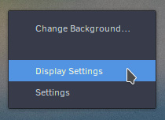
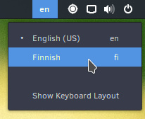
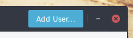
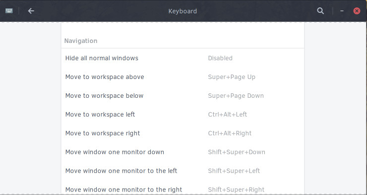

# Configuration

# System

## Date and Time

To change the date and time settings in GNOME, you can open the Overlay using the `Super` button on your keyboard or by clicking the applications icon in the dock and then finding and clicking on "Date & Time".

You will be presented with the following window. This window provides you with the ability to enable / disable automatic date & time, automatic time zone changing, and the time format.  You will need to click on "Unlock" and input your user password before changes can be made.

If you wish to change how the time is displayed in the top panel, go back to the Applications Overlay and then find and click on "Tweak Tool".  You can now show the date and / or seconds by opening the Top Bar section.

## Default Applications

With GNOME, you will need to open the Overlay using the `Super` button on your keyboard or by clicking the applications icon in the dock and then finding and clicking on "Details".

Upon entering the Details section, click on "Default Applications" and then use the drop down boxes to select a different default application for each category.  For most categories, you will need to have installed alternative applications before you can change the default settings.  For instance, if you wish to change the default video player from GNOME MPV to VLC then you must first install VLC (available in the Software Center).

*Note: In the image above, we've changed the Web browser and Photo viewer.*

You can specify default applications for individual file types by right clicking on a file and then clicking on "Open With Other Application".

Next, select the application you wish to use from the list.  You may need to click "View All Applications" if you can't see the one you would like to use.  Finish by clicking "Select".  In the future, all files with the same file type will open with the same application.

## Displays

In GNOME, You can configure your display(s) simply by right clicking anywhere on the desktop and clicking "Display Settings".

Alternatively, you can open the Overlay using the `Super` button on your keyboard or by clicking the applications icon in the dock and then finding and clicking on "Displays".

You will then be shown the following window.

Click on the individual display you wish to configure.  You will now be able to select if you wish to use this monitor as the primary or secondary display, mirror it with another display, or turn it off.  This window also gives you the size and aspect ratio, ability to rotate the display, and ability to change the resolution.

Going back to the Displays section, you also have the option to arrange your displays. Click the “Arrange Combined Displays” button and then drag your displays so they are arranged to your liking.

Click "Apply" once you are happy with your changes.  You will be shown a message asking if the display looks OK, if it does, click on "Keep Changes" within 20 seconds.

## Keyboard Layout

With GNOME, open the Overlay using the `Super` button on your keyboard or by clicking the applications icon in the dock and then find and click on "Region and Language".

You will now be shown the following dialog.

Click the `+` button to add an input source (keyboard layout). You will be shown the following dialog.

Here you can select the language and then keyboard layout within each language section. If it does not appear in this list, click the `⋮` button (three vertical dots). This will enable you to search for the keyboard layout you wish to use.

After choosing the keyboard layout, click "Done". You will be brought back to the following dialog with your new keyboard layout. In the image below, we are now using English (US), Finnish, and Swedish layout.

You can remove a keyboard layout by clicking on one of the items, for instance Swedish, then clicking the `-` button.

If you wish to use multiple keyboard layouts, you can switch between them by using the keyboard shortcut `Super + Space` or by clicking on the keyboard layout icon shown in the system tray. The icon will automatically appear when you have 2 or more keyboard layouts selected.

### IBus

For ease of use, GNOME has IBus up and running by default. If you need an additional IBus IME see: [IBus](/software/localization/ibus/)

You can now switch between your layouts by using the keyboard shortcut `Super + Space` or by clicking on the keyboard layout icon shown in the system tray.

## Language

With GNOME, open the Overlay using the `Super` button on your keyboard or by clicking the applications icon in the dock and then find and click on "Region and Language".

You will now be shown the following window.  This window allows you to change your language, formatting for dates and times and the language of your keyboard.

Start by clicking "Language". This brings up a selection of languages to chose from.

If your language does not appear in the list, click the ⋮ button at the bottom (three vertical dots) to show all the available languages.  You can use the search box to go directly to your choice or scroll down the list.

Once you have selected the language you wish to use, click "Done". You *may* need to logout and login to your computer for it to take affect.

## Mouse and Touchpad

With GNOME, open the Overlay using the `Super` button on your keyboard or by clicking the applications icon in the dock and then find and click on "Mouse and Touchpad". You will see either settings for your mouse or trackpad, depending on the device.

### Mouse

For mice, you can set:

- The primary button (usually left click) to be left or right.
- Mouse speed.
- Enabling / disabling "natural scrolling" (reversed scrolling direction).

### Touchpad

For touchpads, you can set:

- The primary button (usually left click) to be left or right.
- Enabling / disabling of the touchpad.
- Enabling / disabling "natural scrolling" (reversed scrolling direction).
- Touchpad speed.
- Enabling / disabling of Tap to Click.

### Testing

You can test your settings by clicking the "Test Your Settings" button in the top right of the window.

## Networking

Easily change network settings with GNOME by left or right clicking on the system tray in the top panel and then clicking on "WiFi Not Connected".

Alternatively, you can open the Overlay using the `Super` button on your keyboard or by clicking the applications icon in the dock and then finding and clicking on "Network".

### Non-Hidden Network

Once you have opened the "WiFi Not Connected" menu, click on "Select Network".  Click on the network you wish to join and then on "Connect".

You may now be prompted to authenticate with the network. Type in your password and then click "Connect".

If your password is correct, you will now be authenticated with the network.

### Hidden Network

To join a hidden network, open the "WiFi Not Connected" menu and click on "WiFi Settings".

Next, click on “Connect to Hidden Network...”. It will show the following dialog, where you type the network name and type of security (if any).

If the network is found and has a password, you will be prompted to authenticate with the network.

## Sound and Sound Devices

With GNOME, the volume can be changed by left or right clicking the system tray in the top panel and then simply dragging the volume slider with your mouse.

### Settings

You can access sound settings, including individual application volume controls, and a simple speaker test by opening the Overlay using the `Super` button on your keyboard or by clicking the applications icon in the dock and then finding and clicking on "Sound".

## Users

To add and remove users with GNOME, you can click on the icons in the far right of the top panel.  Click on your name and then on "Account Setting".

Alternatively, you can open the Overlay using the `Super` button on your keyboard or by clicking the applications icon in the dock and then finding and clicking on "Users".

To manage your own or other accounts, you first need to authenticate. Click the "Unlock" button in the top right corner and type your password. Note that you are required to be an administrator. If you're the only user on the system, then your account is an administrator by default.

In the event the password provided is correct, the "Unlock" button will change to "Add User..."

### Adding a User

To add a user, click the "Add User..." button in the top right corner of the Users window.

This will open the Add User window (shown below).

Fill in the required items and then finish adding the new user by clicking "Add" in the top right corner.

### Removing a User

To remove a user, open the Users window and then click on the user you wish to remove.  Now click on the red "Remove User..." button in the bottom right corner.

Upon clicking to remove the user, you will be given the option to keep their files, delete their files, or cancel the removal of the user’s account.

# User Interface

## Desktop Background

The GNOME desktop background can be changed by simply right clicking anywhere on the desktop and selecting "Change background".

Alternatively, you can open the Applications Overlay by clicking the applications icon in the dock and then finding and clicking on "Background".

You will have two options, Background and Lock Screen. Click "Background".

In this section, you can choose between Solus wallpapers, pictures in your Pictures folder, or solid colors. After choosing, click "Select".

## Desktop Icons

In GNOME, you can enable desktop items by opening the Overlay using the `Super` button on your keyboard or by clicking the Applications icon in the dock and then search for and open "Tweak Tool".  You can then toggle them on and off by clicking "Icons on Desktop" under the Desktop section.

You may now add things to your Desktop.  This can be done by dragging an item onto the Desktop or by right clicking an icon and selecting Copy to / Move to Desktop.  Alternatively, click on the "Files" icon in the dock and then move the files you want to the Desktop folder (as shown in the image below).  Please note, the Desktop folder is not visible in "Files" until you've enabled the Desktop icons.

## Workspaces

GNOME enables the switching of workspaces via the Workspace Switcher on the right side of the Activities Overview screen. Application windows can be dragged from the Activities Overview to a workspace, whether it is empty / new, or one that already has windows in it.

<video src="/help/vids/GNOME-Workspace-Switch.mp4" autoplay="autoplay" loop="loop" width="740" height="416"></video>

### Keyboard Shortcuts

GNOME provides a variety of keyboard shortcuts for workspaces.

To view these shortcuts open the Keyboard application and scroll to the Navigation section.

