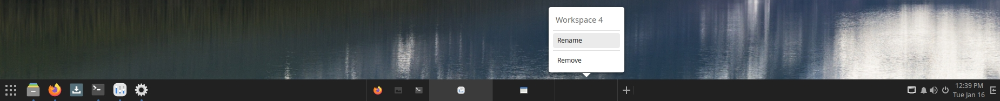

# Configuration

# System

## Date and Time

In Budgie, the easiest way to access the date and time settings is by left clicking on the time in the bottom panel and clicking on "System time and date settings".

Alternatively, you can open the Budgie Control Center, and scroll the left-hand sidebar down to the bottom to find "Date & Time".

You will be presented with the following window. From here, you can enable / disable automatic date & time, automatic time zone changing, and change between AM/PM and 24-hour time formats. Note that changing the system date & time and time zone information requires clicking the 'Unlock' button at the top of the window, and entering your password.

If you wish to change how the time is displayed in the bottom panel, open Budgie Desktop Settings from the Budgie Menu, choose the Bottom Panel from the left-hand sidebar, choose Clock from the list of applets in the middle, then adjust your desired settings on the right-hand side.

If you want to set a custom date & time format, the ["conversion specifications" referenced by the POSIX standards](https://pubs.opengroup.org/onlinepubs/9699919799/utilities/date.html) list the options that can be entered.

## Default Applications

You can configure default applications in Budgie by opening the Budgie Control Center, and scrolling the left-hand sidebar down to "Default Applications".

The drop down boxes here enable choosing the default application for each category of file. For most categories, you will need to have already installed alternative applications before you can change the default settings. For instance, if you wish to change the default video player from Celluloid to VLC, then you must first install VLC (available in the Software Center).

You can specify default applications for individual file types by right-clicking on a file and clicking on "Open With" from the popup menu, then choosing "Other Application".

Next, select the application you wish to use from the list, then click "Set as default" below the list. Finish by clicking "OK". In the future, all files with the same file type will open with the chosen application.

## Displays

You can configure your display(s) in Budgie by opening the Budgie Menu and then clicking on "Displays" in the System Settings category.

You will then be shown the following window.

Click on the individual display you wish to configure. You will now be able to select if you wish to use this monitor as the primary or secondary display, mirror it with another display, or turn it off. This window also gives you the size and aspect ratio, ability to rotate the display, and ability to change the resolution.

Going back to the Displays section, you also have the option to arrange your displays. Click the “Arrange Combined Displays” button and then drag your displays so they are arranged to your liking.

Click "Apply" once you are happy with your changes. You will be shown a message asking if the display looks OK, if it does, click on "Keep This Configuration".

## Keyboard Layout

Using Budgie, you can change your keyboard layout in the Budgie Control Center. Click on the Budgie Menu, click the System Settings icon at the bottom or "Budgie Control Center" in the application list, and then click on "Keyboard" in the System Settings category.

Click the "+" button to add an input source (keyboard layout). You will be shown the following dialog.

Here you can select the language and then keyboard layout within each language section. If it does not appear in this list, click the `⋮` button (three vertical dots). This will enable you to search for the keyboard layout you wish to use.

After choosing the keyboard layout, click the "Add" button at the top of the window. You will be brought back to the following dialog with your new keyboard layout. In the image below, we are now using English (US) and English (UK) layouts.

You can remove a keyboard layout by clicking on one of the items, for instance Swedish, then clicking the "⋮" button, then choosing "Remove".

If you wish to use multiple keyboard layouts, you can switch between them by using the keyboard shortcut `Super + Shift + Space`, or by adding the Keyboard Layout Indicator applet to your Budgie panel.

### Keyboard Layout Indicator

To add the Keyboard Layout Indicator to your panel, open the Budgie Desktop Settings app from the Budgie Menu, then click "Bottom Panel" on the left-hand sidebar.

On the right side of the window, click the "+" button next to "Add applet".

Find the Keyboard Layout Indicator entry and select it, then click "Add" at the top of the window. This will add the Keyboard Layout Indicator (to the center section by default), as shown below.

### IBus

Budgie comes with IBus ready to go straight out of the box. If you need an additional IBus IME see: [IBus](/docs/user/software/localization/ibus/)

You will now be able to switch between your keyboard layouts by using the keyboard shortcut `Super + Shift /+ Space` or by using the Keyboard Layout Indicator applet.

## Language

You can change your language in Budgie by opening the Budgie Menu and then clicking on "Region and Language" in the System Settings category.

You will now be shown the following window. This window allows you to change your language, formatting for dates and times and the language of your keyboard.

Start by clicking "Language". This brings up a selection of languages to chose from.

If your language does not appear in the list, click the ⋮ button at the bottom (three vertical dots) to show all the available languages. You can use the search box to go directly to your choice or scroll down the list.

Once you have selected the language you wish to use, click "Done". You _may_ need to logout and login to your computer for it to take affect.

## Mouse and Touchpad

You can configure the settings of your mouse and / or touchpad by opening the Budgie Menu and then clicking on "Mouse and Touchpad" in the System Settings category. You will see either settings for your mouse or trackpad, depending on the device.

### Mouse

For mice, you can set:

- The primary button (usually left click) to be left or right.
- Mouse speed.
- Enabling / disabling "natural scrolling" (reversed scrolling direction).

### Touchpad

For touchpads, you can set:

- The primary button (usually left click) to be left or right.
- Enabling / disabling of the touchpad.
- Enabling / disabling "natural scrolling" (reversed scrolling direction).
- Touchpad speed.
- Enabling / disabling of Tap to Click.

### Testing

You can test your settings by clicking the "Test Your Settings" button in the top right of the window.

## Network

To configure your network settings in Budgie, start by opening the Budgie Menu and then click on "Network" in the System Settings category.

To configure wireless, go to the Wi-Fi section. If your wireless is currently turned off, click the toggle button, leave the Network section, and go back in.

### Non-Hidden Network

In the WiFi section of the Network settings window, click the access point you wish to connect to.

You may now be prompted to authenticate with the network. Type in your password and then click "Connect".

If your password is correct, you will now be authenticated with the network.

### Hidden Network

If you wish to connect to a hidden network, click “Connect to Hidden Network...” in the WiFi section of the Network settings window. It will show the following dialog, where you type the network name and type of security (if any).

If the network is found and has a password, you will be prompted to authenticate with the network.

## Sound and Sound Devices

To change the volume in Budgie, simply left click on the speaker icon in the system tray and drag the slider or use the plus and minus icons to reach your desired level.

### Settings

You can access sound settings via the Sound applet in Raven, the Notification and Widget Center. Open Raven, either by clicking on its icon in the far right of the system tray or using the keyboard shortcut `Super + A`. The Sound applet allows you to enable, disable and alter input and output methods as well as providing a simple volume slider.

You can access further sound settings, including individual application volume controls, and a simple speaker test by opening the Budgie Menu and then clicking on "Sound" in the System Settings category.

## Users

To add and remove users with Budgie, start by opening the Budgie Menu and then click on "Users" in the System Settings category.

To manage your own or other accounts, you first need to authenticate. Click the "Unlock" button in the top right corner and type your password. Note that you are required to be an administrator. If you're the only user on the system, then your account is an administrator by default.

In the event the password provided is correct, the "Unlock" button will change to "Add User..."

### Adding a User

To add a user, click the "Add User..." button in the top right corner of the Users window.

This will open the Add User window (shown below).

Fill in the required items and then finish adding the new user by clicking "Add" in the top right corner.

### Removing a User

To remove a user, open the Users window and then click on the user you wish to remove. Now click on the red "Remove User..." button in the bottom right corner.

Upon clicking to remove the user, you will be given the option to keep their files, delete their files, or cancel the removal of the user’s account.

# User Interface

## Desktop Background

To change the desktop background in Budgie, open the Budgie Control Center by selecting "System Settings" from either the Budgie Menu, or by right-clicking on a blank spot on the desktop.

Once the Budgie Control Center is open, click "Background" on the left-hand sidebar.

Click one of the images displayed on the right to choose a pre-installed background image, or click "Add Picture..." in the headerbar to add one of your own image files to the available options.

## Desktop Icons

Desktop Icons are enabled by default when Budgie is installed for the first time. To check or toggle this setting, open the Budgie Desktop Settings app by selecting "Budgie Desktop Settings" from the Budgie Menu, or from the pop-up menu when right-clicking on a blank spot on the desktop.

In the Budgie Desktop Settings app, click Desktop in the left-hand sidebar - Desktop Icons is the first toggle switch on that screen.

To place files on your desktop, you can either drag them directly onto the Desktop, or move the files you want to the Desktop folder within the Nemo file manager app (as shown in the image below).

## Workspaces

Budgie enables the switching of workspaces via the Workspace Switcher. You can enable workspaces in Budgie by adding the Workspace Switcher applet to your panel.

To add this applet, open the Budgie Control Center by selecting "System Settings" from either the Budgie Menu, or by right-clicking on a blank spot on the desktop. Once in the Budgie Control Center, in the left-hand sidebar, select the panel to which you want to add the Workspace Switcher (choose the default Bottom Panel if you don't want to add more panels at this time).

Click the + button next to 'Add applet' on the right side of the window. This will open the list of available applets - scroll down until you find `Workspace Switcher`, select it, and then click the 'Add' button in the top-right of the window.

You should now see your workspaces available in the main Budgie panel. Applications can be moved between workspaces by dragging and dropping their icons within the Workspace Switcher.

### Keyboard Shortcuts

Budgie provides a variety of keyboard shortcuts for workspaces.

To view these shortcuts, open the Budgie Control Center app, choose the Keyboard section in the left-hand sidebar, then scroll down in the right part of the window to choose 'Keyboard Shortcuts'.

Workspace shortcuts are contained in the 'Navigation' section of the Keyboard Shortcuts window.

### Workspaces Configuration

There are 4 workspaces available in Budgie by default. To add a new workspace, click on the `+` button.

If you wish to remove or rename your workspace, right click on the desired workspace and select rename or remove.

