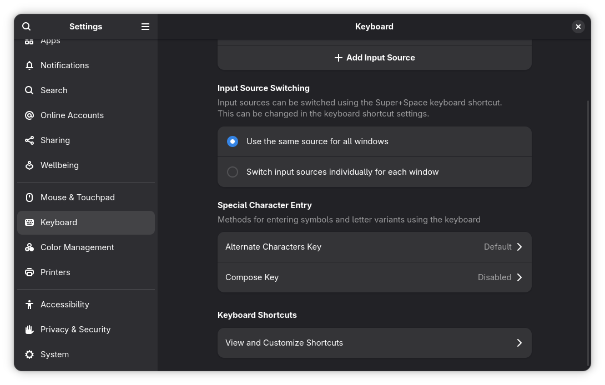
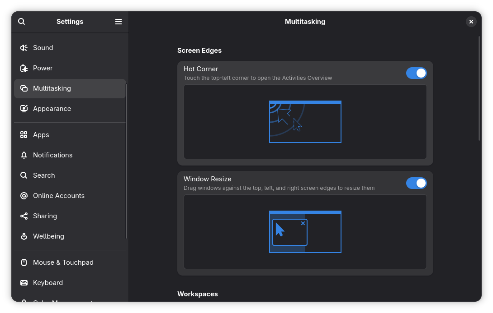
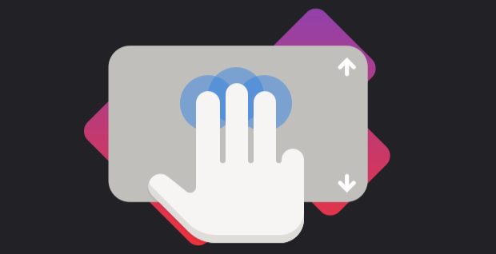
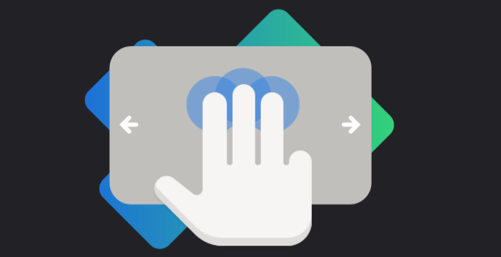
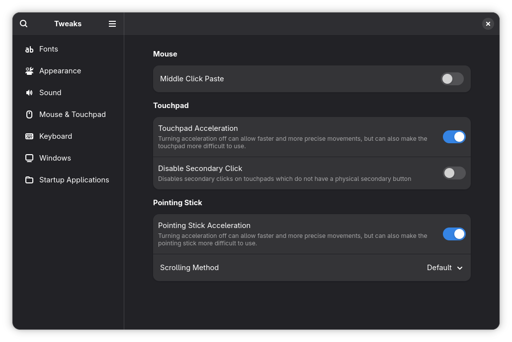
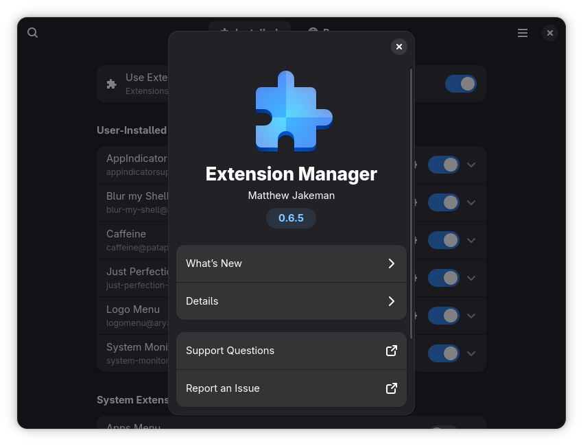

# Tips and Tricks

## GNOME Keyboard Shortcuts

GNOME has built-in keyboard shortcuts for various tasks, but can be changed to your preferences in
the Settings > Keyboard > View and Customize Keyboard Shortcuts.

| Keyboard Shortcut                  | Action                                                     |
| ---------------------------------- | ---------------------------------------------------------- |
| Alt + F2                           | Open GNOME Run dialog                                      |
| Alt + F4                           | Kill the active window                                     |
| Alt + Tab                          | Open application switcher overlay                          |
| Super                              | Open Activities Overview                                   |
| Super + A                          | Open the App Grid                                          |
| Super + L                          | Lock the screen                                            |
| Super + S                          | Open Quick Settings                                        |
| Super + M (_or Super + V_)         | Open Notification Center                                   |
| Super + H                          | Minimize current window                                    |
| Super + Up                         | Maximize current window                                    |
| Super + Down                       | Restore window                                             |
| Super + Left                       | View split on left                                         |
| Super + Right                      | View split on right                                        |
| Super + F1                         | Launch help browser                                        |
| Super + Space                      | Switch to next input source                                |
| Shift + Super + Space              | Switch to previous input source                            |

## Hot Corners

GNOME Hot Corner is a feature that instantly opens the Activities Overview when you flick your 
mouse in the very top left corner of the screen. Can be found in Settings under Multitasking.

## Super Key (_or the Windows Key_)

_Hit the Super Key any time to get an overview, switch or launch apps, and search for anything on your computer. It's magic._

## Touchpad Gestures

Swipe Up with three fingers to open the Activities Overview or swipe left or right with three fingers to 
switch workspaces.

## GNOME Tweaks

An application that lets you access more settings such as font rendering, startup applications, 
and customizations like cursor styles.

## Extension Manager

Available on the Software store, it is a utility for browsing, installing, and managing GNOME Shell Extensions. This tool allows you to search and install extensions from extensions.gnome.org without needing a web browser or the GNOME Shell browser connector.

