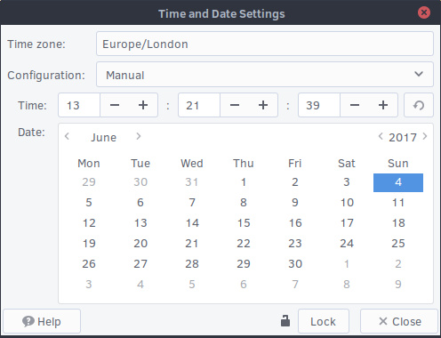
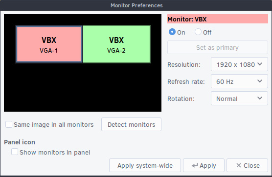
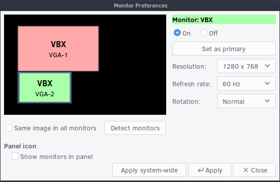
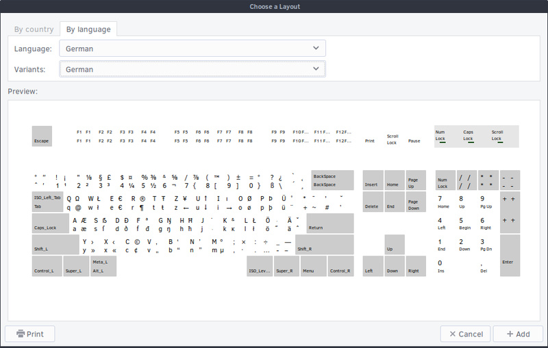
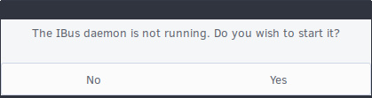
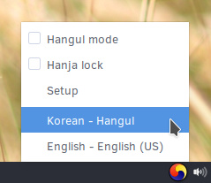
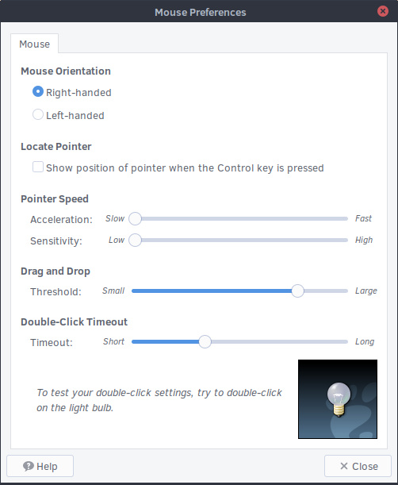
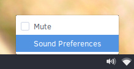
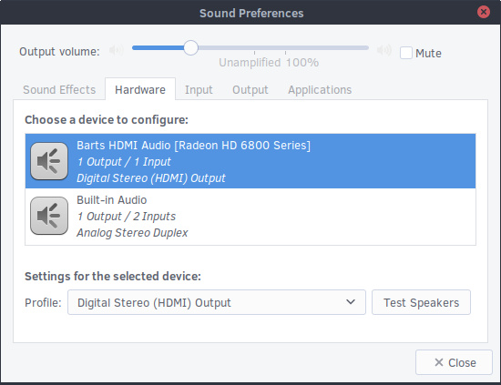
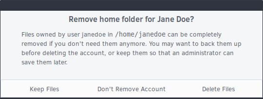

# Configuration

# System

## Date and Time

Using MATE, there are a couple of different ways to change the date and time. You can right click on the time in the bottom panel and click on "Preferences".

This opens the Clock Preferences window and allows you to show the date, seconds or use 24 hour time.

To change the time, click on "Time Settings" at the bottom of this window.

Once you have the correct time, you can click on "Set System Time".

Alternatively, if you wish to change your timezone, open the Brisk Menu and then click on "Administration" followed by "Time and Date". Click on "Unlock" and input your user password so that you can alter the time zone.

## Default Applications

Using MATE, open the Brisk Menu and click on "Preferences" and then on "Preferred Applications".

In this section you will need to click one of the five tabs at the top to find the category you wish to change. For most categories, you will need to have installed alternative applications before you can change the default settings. For instance, if you wish to change the default image viewer from Eye of MATE to GIMP then you must first install GIMP (available in the Software Center).

You can specify default applications for individual file types by right clicking on a file and then clicking on "Open with other Application...".

Next, select the application you wish to use and make sure "Remember this application for "your file type" files" is ticked. Finish by clicking "Open". In the future, all files with the same file type will open with the same application.

## Displays

With MATE, open the Brisk Menu and click on "Preferences" and then on "Displays".

This opens the Monitor Preferences window and your display(s) will be represented by 1 or more colored boxes. Click on the individual display you wish to configure. You will now be able to select if you wish to set this monitor as the primary display, mirror all displays by turning on "Same image in all monitors", or turn it off. This window also gives you the ability to change the aspect ratio, rotate the display, and to change the resolution.

You can arrange your displays by dragging the colored boxes to your preferred positions, as shown below.

Click "Apply" once you are happy with your changes. If you would like to apply the changes to all the user accounts on your system, click on "Apply system-wide". You will be shown a message asking if the display looks OK, if it does, click on "Keep This Configuration" within 30 seconds.

## Keyboard Layout

To change your keyboard layout in MATE, open the Brisk Menu and click on "Preferences" and then on "Keyboard". This will open the Keyboard Preferences window, now click on the "Layouts" tab.

To add a layout, click on the "+ Add..." button. The 2 tabs at the top of the chooser window give you the option to find your layout by country or by language. The preview gives you a graphical representation of each layout. Once you are happy with your selection, click on "+ Add".

You can remove a keyboard layout by selecting one of the items in your layouts list and then clicking the "- Remove" button.

If you wish to use multiple keyboard layouts, you can switch between them by left clicking on the keyboard layout icon shown in the system tray. The icon will automatically appear when you have 2 or more keyboard layouts selected. A right click allows you to open the keyboard preferences window and to see the graphical view of your current layout.

To enable keyboard shortcuts for easy switching, re-open the Keyboard Preferences window and open the "Layouts" tab again. Now click on the "Options..." button. This will open a detailed options list, look for and click on "Switching to another layout". Select one or more of the available keyboard shortcuts and then finish by clicking "X Close".

### IBus

By default, IBus needs to be started in MATE before it can be used. Open the Brisk Menu, click on "Preferences" and then on "IBus Preferences". You will be asked if you wish to start the IBus daemon, click "Yes".

If you wish to have the IBus daemon start automatically every time you start Solus MATE, Open the Brisk Menu, click on "Preferences" and then on "Startup Applications". Under the Startup Programs tab, click on "+ Add".

In the Command box, you will need to write `ibus-daemon --xim`. If you wish, you can also fill in a Name and Comment but these are not compulsory. Once you are happy with your inputs, click the "+ Add" button. IBus will now run each time you boot your computer.

If you need an additional IBus IME for your language see: [IBus](/docs/user/software/localization/ibus/)

Finish by closing the IBus Preferences window. You can now switch between your layouts by using the keyboard shortcut `Super + Space`.

Or by left clicking on the keyboard layout icon shown in the system tray and selecting the layout you wish to use.

## Mouse and Touchpad

With MATE, open the Brisk Menu and click on "Preferences" and then on "Mouse". You can toggle between the mouse and touchpad settings using the tabs at the top of the Mouse Preferences window. Click "Close" once you have finished making changes.

### Mouse

For mice, you can set:

- Left-handed or right-handed. This will change your primary button.
- Locate the pointer when the Control key is pressed.
- Mouse speed and sensitivity.
- Drag and Drop threshold. This is designed to prevent accidental dragging and dropping by setting the distance required to initiate a drag.
- Double click timeout. The length of time between 2 mouse clicks for it to register as a double click.

### Touchpad

For touchpads, you can set:

- Enabling / disabling of the touchpad.
- Enabling / disabling of the touchpad whilst typing.
- Enabling / disabling of mouse clicks with the touchpad.
- Two and three finger click emulation.
- Various edge and two finger scrolling options.
- Enabling / disabling "natural scrolling" (reversed scrolling direction).
- Touchpad speed and sensitivity.

## Networking

With MATE, you can manage your network settings by left or right clicking on the network icon in the bottom panel system tray. A left click will bring up any wireless or wired connections currently available whilst a right click allows you to disable networking, view your current connection information and to create new connections and networks by clicking "Edit Connections...".

### Non-Hidden Network

To connect to a network, left click on the network icon in the system tray. This will show you a selection of the networks currently available and you may need to click on "More networks" to find the one you want.

You may now be prompted to authenticate with the network. Type in your password and then click "Connect".

If your password is correct, you will now be authenticated with the network.

Should you wish to disconnect from a network, left click on the network icon again and then click on "Disconnect" underneath the network you wish to leave.

### Hidden Network

To connect to a hidden network, left click on the network icon in the system tray and then on "Connect to Hidden Wi-Fi Network...". You will now be asked for the network name and type of security (if any).

If the network is found and has a password, you will be prompted to authenticate with the network.

## Sound and Sound Devices

To alter the volume in MATE, left click on the speaker icon in the bottom panel system tray and then drag the volume slider with your mouse.

### Settings

You can access sound settings, including individual application volume controls, and a simple speaker test by right clicking on the speaker icon in the bottom panel system tray and then clicking on "Sound Preferences". Alternatively, you can open the Brisk Menu and then click on "Preferences" followed by "Sound".

This will open the Sound Preferences window as shown below.

## Users

To add and remove users with MATE, open the Brisk Menu and click on "Administration" and then on "Users and Groups".

### Adding a User

To add a user, click the "+ Add" button underneath the list of users. You will be asked to input your password before you can make changes.

Fill in the required items and then finish adding the new user by clicking "OK" in the bottom right corner.

### Removing a User

To remove a user, open the User Settings window and then click on the user you wish to remove. Now click on the "- Delete" button underneath the list of users.

Upon clicking to remove the user, you will be given the option to keep their files, delete their files, or cancel the removal of the user’s account.

# User Interface

## Desktop Background

If you wish to change the MATE desktop background, simply right click anywhere on the desktop and select "Change Desktop Background".

Alternatively, open the Brisk Menu and click on "Preferences" and then on "Appearance". Click on the "Background" tab at the top if it isn't already selected.

In this section, you can choose between Solus wallpapers, solid colors, gradients or using your own pictures by clicking "Add". After choosing, click "Close".

## Desktop Icons

MATE has desktop icons enabled by default. If you wish to disable or re-enable them, open the Brisk Menu, click on "Preferences" and then on "MATE Tweak". You can then toggle them on and off by clicking "Show Desktop Icons" under the Desktop section.

You may now add things to your Desktop. This can be done by dragging an item onto the Desktop, right clicking an icon and selecting Copy to / Move to Desktop or by opening the Caja file manager and then moving the files you want to the Desktop folder (as shown in the image below).

## Workspaces

In MATE, workspaces are enabled by default. You can move between workspaces by using the keyboard shortcuts `Ctrl + Alt + Left` and `Ctrl + Alt + Right`.

To send an application to a different workspace, right click on the applications titlebar and then use the "Move to Another Workspace" option or "Move to Workspace Right".

One of the easiest ways to view and manage your workspaces is by using the Workspace Switcher. Right click inside the bottom panel and then click on "+ Add to Panel...".

Towards the bottom of the list you will find the Workspace Switcher. Click on it and then finish by clicking "+ Add".

You should now be able to see 4 slightly darker boxes to the left of your MATE system tray in the bottom panel. The workspace you are currently viewing will be highlighted in blue.

In addition to using keyboard shortcuts, you will now be able to switch workspaces by clicking on them in the bottom panel. You can also drag one workspace onto another in the bottom panel which will move the current active application to the new workspace.

### Keyboard Shortcuts

MATE provides a variety of keyboard shortcuts for workspaces. By default, the keyboard shortcuts for switching directly to a certain workspace are disabled.

To enable these and to also view all other available shortcuts open the Brisk Menu and click on "Preferences" and then on "Keyboard Shortcuts". The workspace shortcuts are listed under Windows Management.

### Workspaces Configuration

By default, MATE provides you with 4 workspaces. If you would like to have more, less or change their names you must first add the Workspace Switcher to your bottom panel, as detailed above. You'll then be able to right click on the Workspace Switcher and select "Preferences".

Use the plus and minus icons to add or remove workspaces. You can rename workspaces by double clicking on the current names and typing in an alternative. Click "X Close" once you are happy with your changes.

