# Configuration

## Opening System Settings
You can open the system settings in Solus Plasma using any of the following methods:

| Method           | Description                                                            |
|------------------|------------------------------------------------------------------------|
| Application menu | Open the application menu and go to **Settings** > **System Settings** |
| KRunner          | Press `Alt + F2` or `Alt + Space`, type `systemsettings`, and press Enter       |
| Terminal         | Open a terminal window and execute `systemsettings`                    |

## Date and Time
1. In the [**System Settings**](#opening-system-settings) screen, go to **Personalization** > **Regional Settings** > **Date and Time**.
2. Configure the date and time of your system.
   - If you want Solus to set the date and time automatically, select **Set date and time automatically**.
   - If you want to set the date and time manually, clear the **Set date and time automatically** checkbox, then use the available controls.
  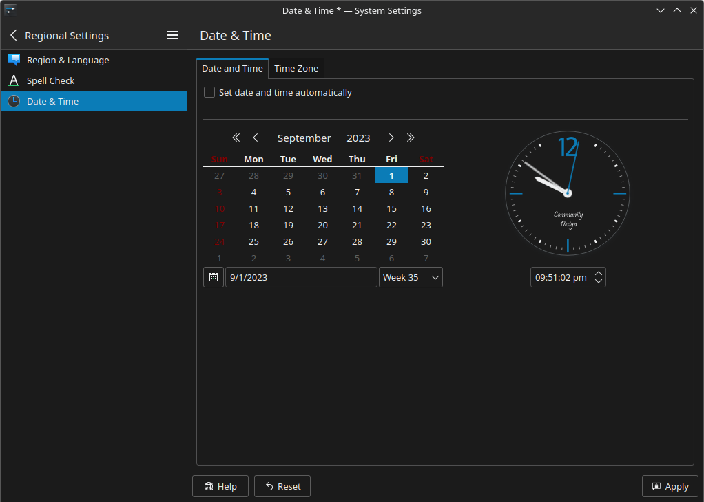
1. (Optional) Configure the time zone of your system.
   1. Go to the **Time Zone** tab.
   2. Select a time zone from the list.
2. Click **Apply**.
3. (Optional) Customize how the time and date display in the bottom panel.
   1. Right-click the digital clock widget on the bottom panel.
   2. Select **Configure Digital Clock...**
   3. Configure the available settings as needed.

## Default Applications
### Configuring Default Applications from System Settings
In the [**System Settings**](#opening-system-settings) screen, go to **Personalization** > **Applications** > **Default Applications**, then use the menus to select your preferred default applications.

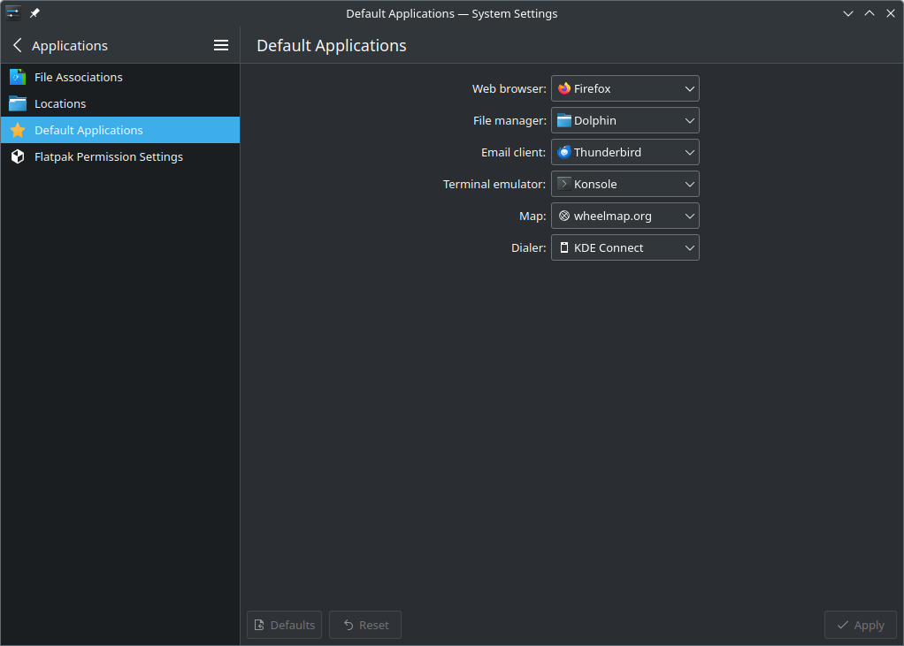

### Configuring Default Applications from the File Manager
1. Open Dolphin.
2. Navigate to the folder that contains the file you want to open.
3. Right-click the file.

    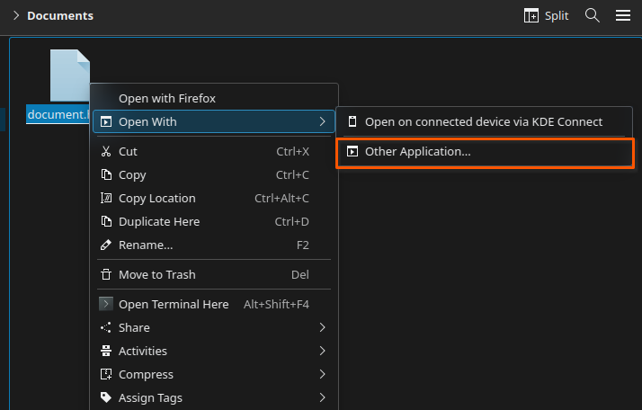
4. Go to **Open With** > **Other Application**.

    The **Choose Application** dialog appears.
5. Choose the application you want to use from the list.
6. Select **Remember application association for all files of type [file type]**.
7. Click **OK**.

   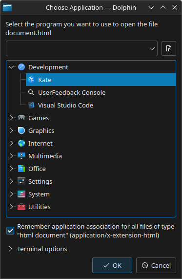

## Displays

:::tip

Press `Super + P` to access the screen layout settings.

:::

1. In the [**System Settings**](#opening-system-settings) screen, go to **Hardware** > **Display and Monitor** > **Display Configuration**.
2. Select the display you want to configure.
3. Configure the available settings as needed.
   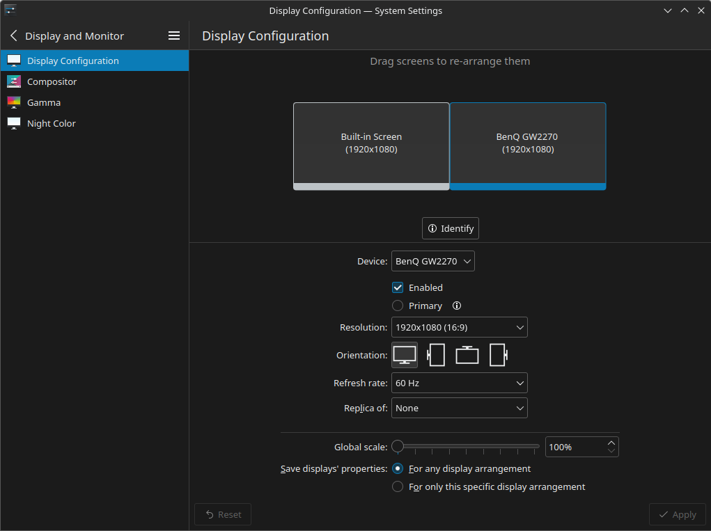
4. Click **Apply**.  


## Keyboard Layout
### Configuring Keyboard Layouts

:::caution Important

If you need to input languages that do not use Latin characters (for example, Chinese or Japanese), [use IBus instead](#using-ibus).

:::

1. In the [**System Settings**](#opening-system-settings) screen, go to **Input Devices** > **Keyboard** > **Layouts**.
   
   The layouts screen appears.
   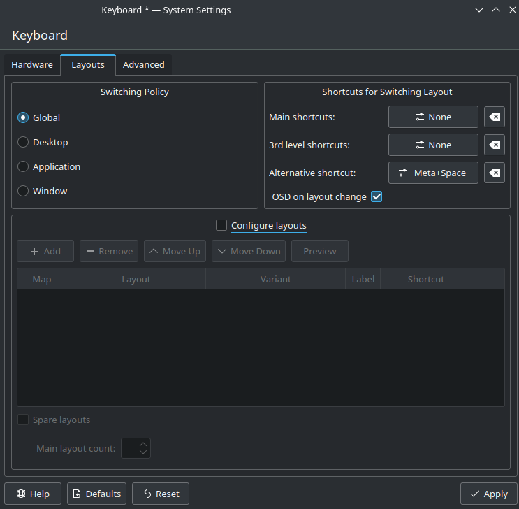
2. Select **Configure layouts**.
3. Configure keyboard layouts as you need.
   - To add a keyboard layout click **Add**, select a layout from the list, and click **OK**.
   - To remove a keyboard layout select a layout from the list and click **Remove**.
   - To order the list of keyboard layouts, select a layout from the list, then use the **Move Up** and **Move Down** buttons to reorder the list.
4. Configure a keyboard shortcut to switch between layouts by using the options under **Shortcuts for Switching Layout**.
   -  To use the default shortcuts Solus Plasma provides, use the **Main shortcuts** and **3rd level shortcuts** options.
   -  To use a custom shortcut, use the **Alternative shortcut** option.
5. Click **Apply**.  

### Using IBus
Solus Plasma includes IBus installed by default. However, you need to enable and integrate IBus with Plasma before usage.

:::caution Important

Using IBus overrides the configuration in the **Layouts** section of **System Settings**

:::

1. Open the `/home/[username]/.bashrc` file with a text editor.
2. Add the following lines at the end of the file.
```
export GTK_IM_MODULE=ibus
export QT_IM_MODULE=ibus
export XMODIFIERS=@im=ibus
```
3. Save the file.
4. Configure IBus to autostart.
   1. In the [**System Settings**](#opening-system-settings) screen, go to **Workspace** > **Startup and Shutdown** > **Autostart**.
   2. Click **Add**, then **Add Application**.
   3. In the search box, enter `ibus-daemon -rxR` and press **OK**.
5. Log out from your session, then log in again.
6. Configure keyboard layouts as you need.
   1. Open **IBus Preferences** from the application launcher.
   2. In the **Input Method** tab, add the keyboard layout you need.
   
:::caution Important

Some keyboard layouts require [installing additional packages](../../software/localization/ibus.md).

:::

## Mouse and Touchpad
1. In the [**System Settings**](#opening-system-settings) screen, go to the appropriate configuration screen:
   - To configure the mouse, go to **Input Devices** > **Mouse**.
   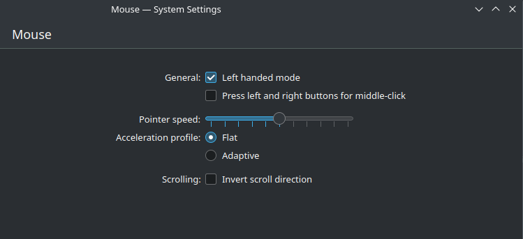
   -  To configure the touchpad, go to **Input Devices** > **Touchpad**.
   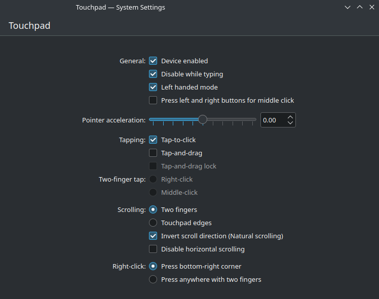  
2. Configure the available settings as needed.
3. Click **Apply**.

## Network Settings
The **Networks** widget on the bottom panel allows you to perform frequent networking tasks, such as connecting to a Wi-Fi network or enabling airplane mode.

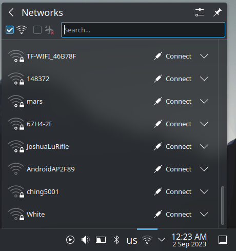

### Connecting to a Hidden Wi-Fi Network
1. In the **System Settings** screen, go to **Network** > **Connections**.
2. Click the **Add new connection** icon (+).
3. Select **Wi-Fi**.
4. Click **Create**.

   The **New Connection** window appears.
   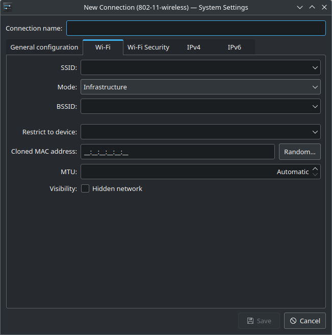
5. In the **Wi-Fi** tab, specify the name (SSID) and basic network settings.
6. In the **Wi-Fi Security** tab, configure the password or other authentication settings.
7. Use the **IPv4**, **IPv6** and **General configuration** tabs to configure additional settings, such as DNS servers.
8. Click **Save**.

## Sound and Sound Devices

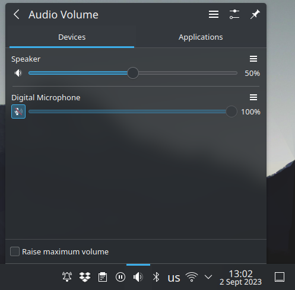

The **Audio Volume** widget on the bottom panel allows you to perform the following tasks:

| Task                                 | Description                                                                                             |
|--------------------------------------|---------------------------------------------------------------------------------------------------------|
| Select the active output device      | Select any of the available output devices to change the active output device of your system.           |
| Select the active input device       | Select any of the available input devices to change the active input device of your system.             |
| Control the volume of a device       | Use the sliders to adjust the master volume of an input/output device.                                  |
| Adjust the volume for a specific app | The **Volume** tab allows you to control the volume for a specific application.                         |
| Open the audio settings              | Click the **Configure Audio Devices** button to open the audio configuration screen in System Settings. |

## Users

### Adding User Accounts
1. In the [**System Settings**](#opening-system-settings) screen, go to **Personalization** > **Users**.
2. Click **Add New User**.
3. Configure the necessary settings.

   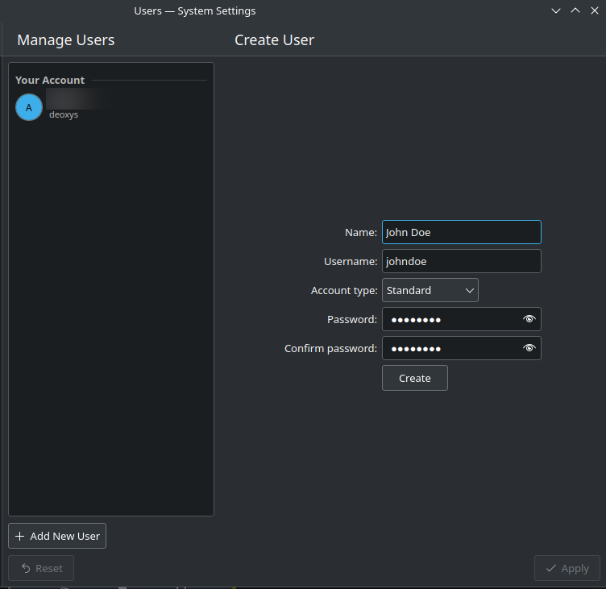
4. Click **Create**

   The **Authentication Required** window appears.
5. Specify your user password and click **OK**. 

### Removing User Accounts
1. In the [**System Settings**](#opening-system-settings) screen, go to **Personalization** > **Users**.
2. Select an account from the user list.
3. Click **Delete User**.
4. To delete the the user account files, select **Delete files**; to keep the files for posterior use, select **Keep files**.

   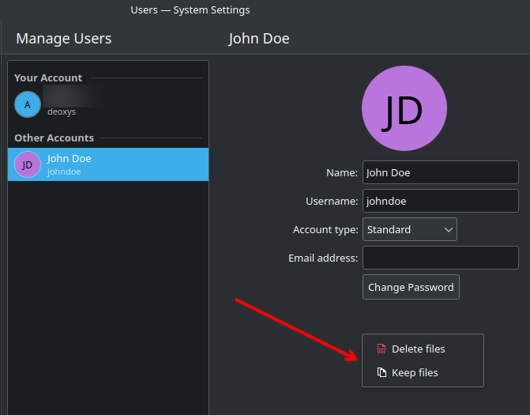

# User Interface
## Customizing the Desktop
The **Desktop Settings** screen allows you to customize various aspects of your desktop, such as the wallpaper and the desktop icons. To open **Desktop Settings** screen, right-click anywhere on the desktop and select **Configure Desktop and Wallpaper...**.

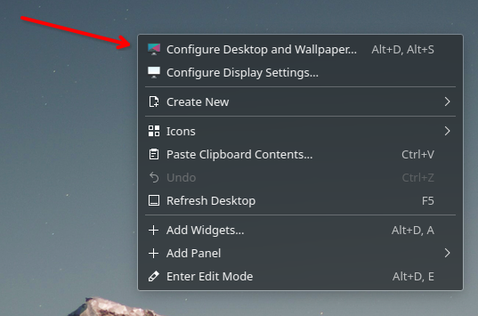

The following table describes how to customize the desktop using the **Desktop Folder Settings** screen.

| Section                                    | Description                                                                          |
|--------------------------------------------|--------------------------------------------------------------------------------------|
| Change the wallpaper                       | Go to the **Wallpaper** section, choose an image from the list, and click **OK**.    |
| Hide the desktop icons                     | Go to the **Wallpaper** section, change **Layout** to **Desktop**, and click **OK**. |
| Configure mouse gestures                   | Go to the **Mouse Actions** section to setup mouse gestures.                         |
| Change the folder displayed on the desktop | Go to the **Location** section, select a location in your system, and click **OK**.  |
| Change the appearance of the desktop icons | Go to the **Icons** section, configure the necessary settings, and click **OK**.     |
| Display only specific files in the desktop | Go to the **Filter** section,configure the necessary settings, and click **OK**.     |

:::info

**Icons** and **Location** are only available when the desktop layout is set to **Folder View**.

:::

## Virtual Desktops
Plasma allows you to have multiple desktops on your computer. 

Virtual desktops are helpful to keep tasks organized and avoid clutter. For example, you could have one virtual desktop for work, one for school, and one for personal use.

Plasma arranges virtual desktops in a grid. You can configure the rows of the grid to suit your needs.

:::note

Solus Plasma has one virtual desktop and one row by default.

:::

### Creating Virtual Desktops
1. In the [**System Settings**](#opening-system-settings) screen, go to **Workspace** > **Workspace Behavior** > **Virtual Desktops**.
2. Define the number of rows in the grid.
3. Create a new virtual desktop.
   1. Click **Add**.
   2. (Optional) Click the **Rename** button to change the name of the virtual desktop.
4. Repeat the previous step to add multiple virtual desktops.

   :::caution 

   Plasma arranges the desktops by the rows automatically.

   :::
5. (Optional) Configure the behavior of the virtual desktops.
   - **Navigation wraps around**: Lets you cycle through your virtual desktops in a loop using keyboard shortcuts or mouse gestures.
   - **Show animation when switching**: Displays animations when switching between virtual desktops.
   - **Show on-screen display when switching**: Displays the name of the current desktop when switching between desktops.
   - **Show desktop layout indicators**: Displays the virtual desktop grid when you switch between desktops.
6. Click **Apply**

:::tip

Plasma displays the virtual desktop grid next to the application launcher button.
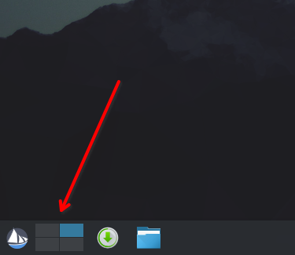

:::

### Switching Between Virtual Desktops
The following table outlines the methods to change between desktops in Solus Plasma.

|Method                               |Description                                                                                                        |
|-------------------------------------|-------------------------------------------------------------------------------------------------------------------|
|Using the applet in the bottom panel |Use the the virtual desktop grid next to the application launcher button to change between your virtual desktops.  |
|Using mouse gestures                 |Move the mouse pointer anywhere in the desktop, then move the mouse wheel to change between your virtual desktops. |
|Using keyboard shortcuts             |Open System Settings, go to **Workspace** > **Shortcuts** > **KWin**, then search for `desktop` to see the available keyboard shortcuts to switch between virtual desktops  |

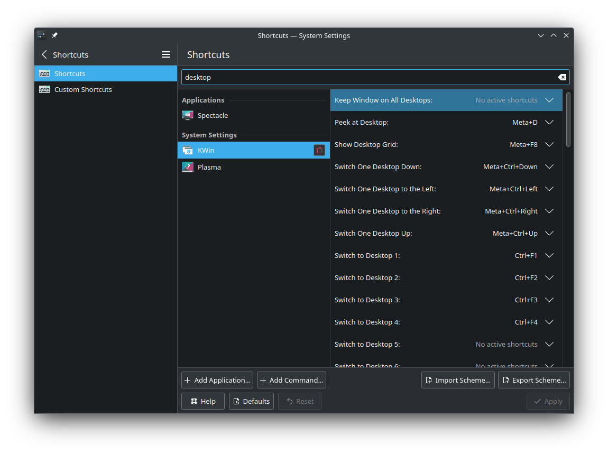

:::note

Some of the keyboard shortcuts are disabled by default.

:::