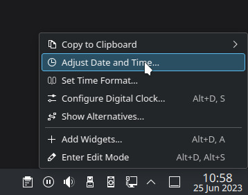
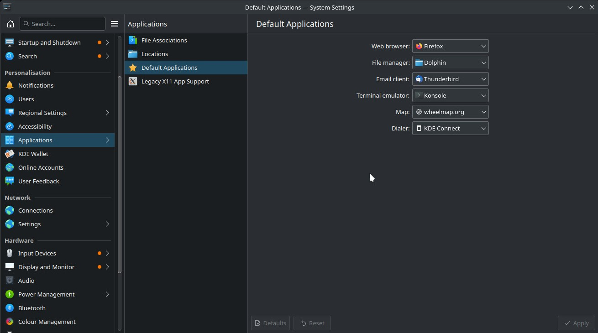

# Configuration

:::caution This page is a work in progress and some sections are not yet completed.
:::

# System

## Date and Time

Using Plasma, there are a few ways to change the date and time. You can right click on the time in the bottom panel and click on "Adjust time and date".

This opens the Date & Time settings submenu and allows you to set the time and date.

TODO: Add Instructions on how to set time format .e.g 12/24 hour format as well as how to show seconds.

## Default Applications

Using Plasma, open the Kickoff menu search for "Default Applications" and left click on the result.

In this section you can edit common default application preferences. To use an alternative default application you must have a suitable alternative installed. E.g. Brave is an alternative web browser to Firefox. You can search for alternative software choices in the Software Center.

If you wish for more fine-grained control over what file extensions open in what application you can click on "File Associations", choose the file extension then, finally choose which application opens that type of file extension by default.

TODO: You can also right click a file in dolphin and choose the default application from there but the user needs to be familiar with file browsing first.

## Displays

## Keyboard Layout

### IBus

## Mouse and Touchpad

### Mouse

### Touchpad

## Networking

### Non-Hidden Network

### Hidden Network

## Sound and Sound Devices

## Users

### Adding a User

### Removing a User

# User Interface

## Desktop Background

## Desktop Icons

## Workspaces

### Keyboard Shortcuts

### Workspaces Configuration
