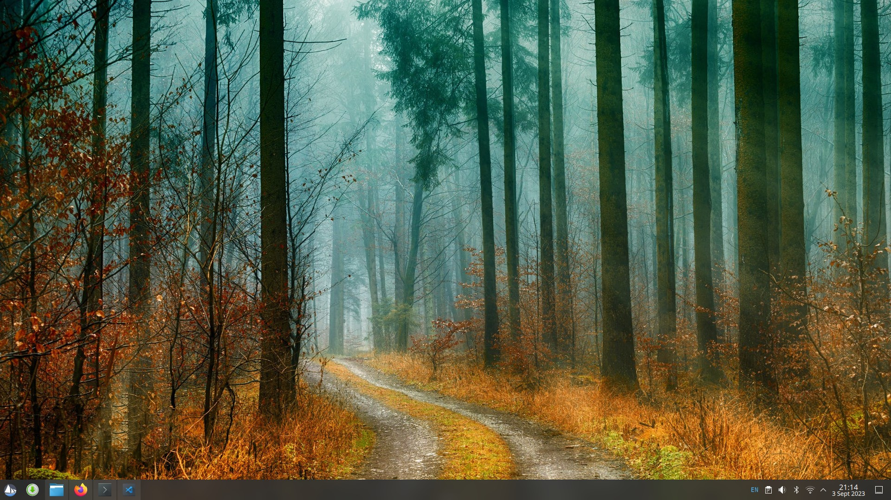

# Plasma

The _Plasma_ desktop is a graphical user interface for Linux distributions that aims to offer users an intuitive and customizable user interface to interact with their devices. The Plasma desktop is developed by KDE.

To learn more about the Plasma desktop and KDE, refer to the following pages:

- [https://kde.org/plasma-desktop/](https://kde.org/plasma-desktop/)
- [https://kde.org/announcements/](https://kde.org/announcements/)
- [https://kde.org/support/](https://kde.org/support/)

***

[Configuration](configuration)

Learn how to customize and configure the Plasma Desktop on Solus.

[Tips and Tricks](tips-and-tricks)

Helpful tips and tricks for using Plasma on Solus.
