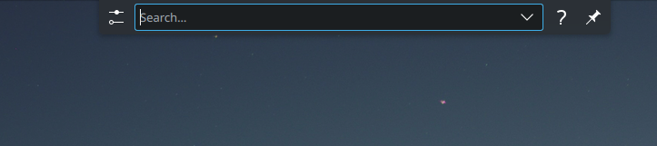

# Tips and Tricks

## Keyboard Shortcuts

:::tip

To see the complete list of keyboard shortcuts available on your system, open the **[System Settings](configuration.md#opening-system-settings)** screen, then go to **Workspace** > **Shortcuts**.

:::

The following table shows some of the keyboard shortcuts available in Solus Plasma.

| Keyboard Shortcut           | Action                                                                 |
| --------------------------- | ---------------------------------------------------------------------- |
| `Alt` + `F2`                | Opens KRunner                                                          |
| `Alt` + `Space`             | Opens KRunner                                                          |
| `Alt` + `F4`                | Closes the active window on the desktop                                |
| `Alt` + `Tab`               | Opens application switcher, switch to the next application on the list |
| `Shift` + `Alt` + `Tab`     | Opens application switcher, switch to previous application on the list |
| `Super`                     | Opens the application menu                                             |
| `Super` + `L`               | Locks the screen                                                       |
| `Super` + `D`               | Shows the desktop                                                      |
| `Print`                     | Opens the screenshot utility (Spectacle)                               |
| `Super` + `Print`           | Captures the active window                                             |
| `Super` + `Shift` + `Print` | Captures a rectangular region of the screen                            |

## Using KRunner

KRunner is a system-wide desktop search and launcher app available on Solus Plasma. KRunner allows you to perform a variety of actions such as launching apps, executing commands, search files and open open system settings.

Open KRunner by pressing `Alt` + `F2` or `Alt` + `Space`.

The following table outlines the actions you can perform using KRunner.

| Action                                          | Description                                                                                                                                                               |
| ----------------------------------------------- | ------------------------------------------------------------------------------------------------------------------------------------------------------------------------- |
| Open an application                             | Enter the name of the application, then select the application from the list.                                                                                             |
| Run a command                                   | Enter the command you want to run and press `Enter`.                                                                                                                      |
| See the man pages of a command                  | Add `#` before a command name and press enter (Example, `#wget`).                                                                                                         |
| Terminate a program                             | Enter `kill [application name]` and press `Enter` (Example: `kill firefox`)                                                                                               |
| Do math operations                              | Enter `=` followed by the calculation you want to perform (Examples: `=2*2`, `=5!`, `=sin(20)`).                                                                          |
| Unit conversions                                | Enter `[measurement] to [destination unit]` (Examples: `200 mi to km`).                                                                                                   |
| Currency conversions                            | Enter `[amount] to [destination currency]`. You can use the ISO code or the name of the currencies to do the conversion (Examples: `200 CAD to NOK`, `50 koruna to yen`). |
| Check the time of other countries or time zones | Enter `time [country]` or `time [time zone]` (Examples: `time finland`, `time gmt-1`).                                                                                    |
| Open files and folders                          | Enter the name of a file or folder, then select an entry from the list.                                                                                                   |
| Switch between windows                          | Enter the name of an open window and select an entry from the **Windows** list.                                                                                           |

:::info

- To see a list of the currencies KRunner supports, see [https://www.ecb.europa.eu/stats/policy_and_exchange_rates/euro_reference_exchange_rates/html/index.en.html](https://www.ecb.europa.eu/stats/policy_and_exchange_rates/euro_reference_exchange_rates/html/index.en.html).
- Unit and currency conversions do not require the `=` symbol.

:::

## Dolphin

Dolphin is the file manager included by default in Solus Plasma. Dolphin has multiple features, including tabs, split views, integrated terminal, and support for various file formats and protocols.

The following table describes some of the keyboard shortcuts you can use in Dolphin.

| Action                                         | Description                                                                                                                                                           |
| ---------------------------------------------- | --------------------------------------------------------------------------------------------------------------------------------------------------------------------- |
| Create a new folder                            | Press `F10` to create a new folder.                                                                                                                                   |
| Enabling dual-pane mode                        | Press `F3` to enable dual-pane mode.                                                                                                                                  |
| Open multiple tabs                             | Press `Ctrl` + `T` to open multiple Dolphin tabs.                                                                                                                     |
| Open a terminal window in the current location | Press `Alt` + `Shift` + `F4` to open a terminal window in the location you have open.                                                                                 |
| Show/hide hidden files                         | Press `Ctrl` + `H` to show/hide hidden files.                                                                                                                         |
| Show/hide the side panel                       | Press `F9` to show/hide the **Places** side panel.                                                                                                                    |
| Switch between the view modes                  | Press `Ctrl` + `1` to display icons in _icons_ view, press `Ctrl` + `2` to display icons in _compact_ view, or press `Ctrl` + `3` to display icons in _details_ view; |

## Context Menu

The _Plasma_ desktop provides a variety of context menus. Context menus display options, settings, and actions applicable to the current context or element you select.

The following table describes some of the context menus available in Plasma.

| Context menu          | Description                                                                              |
| --------------------- | ---------------------------------------------------------------------------------------- |
| Bottom panel settings | Right-click on an empty space of the bottom panel to open the bottom panel context menu. |
| Widget settings       | Right-click on any widget in the bottom panel to open the widget context menu.           |
| Desktop settings      | Right-click anywhere on the desktop to open the desktop context menu.                    |
| File                  | Right-click a file to open the file context menu.                                        |
