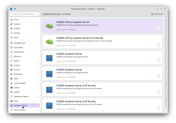
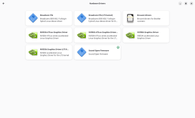

# Hardware

## Preinstalled drivers

The vast majority of hardware on Linux is supported by driver modules included with the Linux kernel. This includes things like:

- CPUs (AMD, Intel)
- Networking
- PCI and PCI Express
- Storage
- USB
- GPUs
- Tablets
- Digital pens

This documentation is to help you find drivers for hardware that is not directly supported, or requires additional configuration to be used on Solus.

:::note

A reboot will be required to use any newly installed driver.

:::

## Proprietary drivers

These can be found in the "Hardware" category in Discover and GNOME Software. What you see in this section will depend on your hardware and what's available for it. If you don't see a Hardware category, it's because there are no additional drivers available for your system. 

**Discover**

**GNOME Software**

      

### GPUs

GPU drivers on Linux are a little complicated. Each driver is actually broken up into multiple pieces. For details, expand the section below.
For AMD and Intel GPUs, you won't need to install anything extra.

GPU driver breakdown

- **Direct Rendering Manager (DRM)**
  This is the part of the driver provided by the Linux kernel and provides just enough functionality to allow other drivers to access the hardware and render to a connected display.
  Linux provides support for AMD, Intel, and NVIDIA GPUs in this basic capacity.
- **OpenGL driver**
  This part of the driver is needed for OpenGL applications. AMD and Intel are fully supported on Linux through Mesa, and do not need further drivers.
- **Vulkan driver**
  This part of the driver is needed for Vulkan applications. AMD and Intel are fully supported on Linux through Mesa, and do not need further drivers.
- **Xorg driver**
  In order to expose certain features to the Xorg Server, AMD and Intel have additional drivers which may be needed for things like variable refresh rate or multiple display support.

For NVIDIA GPUs, all drivers provided by NVIDIA consist of a DRM driver module for the kernel, OpenGL and Vulkan drivers for rendering, and additional drivers for extended features of the hardware.
  Device support for these drivers is very good for newer hardware, but older devices will eventually become unsupported and require the Nouveau drivers instead.
  Performance of this driver is typically the best available and is therefore highly desirable to gamers and content creators.

  
For NVIDIA GPUs, we have a guide for [choosing a driver ](./nvidia-gpu-drivers.mdx)

### Other  hardware
 
Installing additional drivers may improve performance or provide additional features, however they are usually not necessary for normal daily usage.

These drivers for common vendors are available through the software centers, Discover / GNOME Software, or through `eopkg`.  Some can only be installed via command line, as noted below. This is not an exhaustive list, feel free to search the software centers for software that may enhance your hardware.

| Vendor      | Drivers          | Install from |
| ----------- | ---------------- |  ---------------- |
| ASUS        | piper            | SC or `eopkg`  |
| Broadcom    | broadcom-sta     | SC or `eopkg` - must match running kernel |
| Logitech    | piper            | SC or `eopkg`  |
| Razer       | openrazer        | `eopkg` only  |
| Roccat      | piper            | SC or `eopkg`  |
| SteelSeries | piper            | SC or `eopkg`  |
| VMware      | open-vm-tools    | `eopkg`  only |
| Xbox        | xone             | `eopkg`  only |
