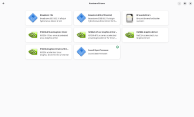
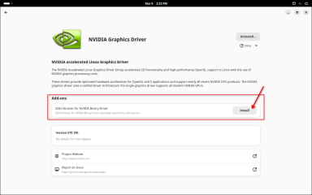
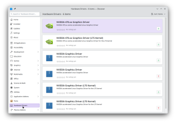
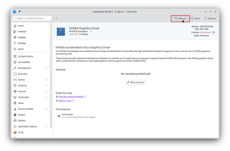

:::note

To use the drivers published by NVIDIA, you will need to know:
- The family your GPU belong's to, which you can find on [the nouveau wiki's code names page](https://nouveau.freedesktop.org/CodeNames.html)
- The kernel running on your system, which you can determine by running

  ```
  uname -r
  ```

:::

## Types of NVIDIA drivers

Linux has three types of drivers for NVIDIA GPUs

- **Nouveau**
  This is the open-source driver, and is loaded automatically if the drivers NVIDIA distributes are not installed.
  Device support has historically lagged behind the drivers provided by NVIDIA, will likely not support newer hardware and does not include Vulkan support.
  Performance of this driver also typically lags behind the drivers NVIDIA provides.
- **NVIDIA open GPU kernel module drivers**
 These are open driver modules, provided by NVIDIA, that are loaded with the kernel.
- **NVIDIA proprietary drivers**
  These are closed-source drivers provided by NVIDIA.

  Device support from both the open and proprietary drivers from NVIDIA is very good for newer hardware, but older devices will eventually become unsupported and require the Nouveau drivers instead. Performance of these drivers is typically the best available and is therefore highly desirable to gamers and content creators.


## Choose the recommended driver for your GPU

- If your device is in the [Compatible GPUs list for the open kernel modules](https://github.com/NVIDIA/open-gpu-kernel-modules), we recommend using this driver.
- If it isn't in that list, check the [NVIDIA manual driver search page](https://www.nvidia.com/en-us/geforce/drivers/) to find the recommended driver branch for your GPU.
- The 580 proprietary drivers are needed for Maxwell, Pascal, and Volta GPUs. This is the final release to offer official updates for these cards.
- The 470 proprietary drivers are *only* needed for older cards which are not supported by the other drivers NVIDIA publishes. This is the last driver that supports Kepler generation GPUs such as GeForce GTX 7xx, some GeForce GTX 6xx, Quadro Kxx, and Tesla Kxx series. This is only packaged for the LTS kernel, so you will need to use that kernel.

  :::warning

  The `nvidia-470*` driver has not been supported by NVIDIA [since January 31, 2023](https://nvidia.custhelp.com/app/answers/detail/a_id/5210/~/end-of-driver-support-for-kepler-series-quadro-desktop-gpu-products). It will be removed from the Solus repository in the not-so-distant future. When it is deprecated, your system will be forced back to the `nouveau` driver. This will result in significant performance drops compared to what you are used to.

  :::

## Install the driver

You'll need to open the package details in your software center to determine which "NVIDIA Graphics Driver" package is the proprietary one vs. the open one. The one that doesn't say "proprietary" is the open kernel module driver.

Install the version of the driver you want that matches the running kernel:  
- "NVIDIA Graphics Driver" for the "current" kernel
- "NVIDIA Graphics Driver (LTS Kernel)" for the "LTS" kernel

You'll also want to install the 32-bit driver, if you wish to use Steam or Wine, see how in the details below

## Installation workflow with screenshots

### GNOME Software

    <details>
    1. Open GNOME Software and click on the Hardware category  
       
       [](GNOME-Software-HW-Drivers_Details.png)
    1. Choose the driver you want
    1. If you want to also install the 32-bit driver, click "Install" under Add-ons  
       
       [](GNOME-Software-32bit-addon.png)
    1. Restart your system

    </details>

### KDE Discover

    <details>
    1. Open KDE Discover and click on the Hardware category  
       
       [](KDE-Discover-HW-Drivers.png)
    1. Choose the driver you want
    1. If you want to also install the 32-bit driver, click "Add-ons" in the top bar  
       
       [](KDE-Discover-32bit-addon.png)
    1. Check the box and Apply Changes
    1. Restart your system

    </details>
