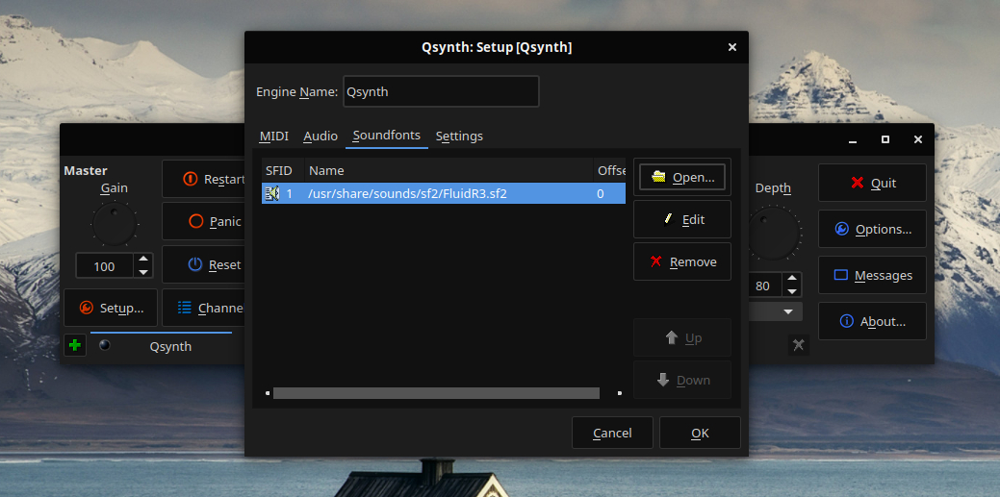

# MIDI Keyboards

These instructions will guide you through how to set up and use a USB-connected MIDI Keyboard on Solus. This will easily let you use the keyboard to play music with a wide set of instruments.

## Installing required software

We will need to install three packages in order to use the keyboard:

1. `qsynth` - A frontend for fluidsynth
2. `qjackctl` - A controller for the JACK audio server
3. `fluid-soundfont` - An open source soundfont to use with fluidsynth

```bash
sudo eopkg it qsynth qjackctl fluid-soundfont
```

## Setting up the soundfont in qsynth

In order to use the soundfont, we need to open up `qsynth` and set the soundfont. For the purposes of this article, it would be `FluidR3.sf2`, however any other soundfont should work fine too. You set the soundfont by clicking on `Setup...` and navigating to `Soundfonts`. There you just need click `Open...` and navigate to the soundfont of your liking. The soundfont that we will be using will be placed in `/usr/share/sounds/sf2/` by default.



## Connecting the keyboard

At this stage you need to first verify that the keyboard is plugged in and turned on. Now we just need to open up `qjackctl` to connect the keyboard on a software level. In `qjackctl` you press on `Graph` and drag the keyboard's output to the input called `FLUID Synth` (Your keyboard name will probably differ from the on in the image below). This step will need to be done every time you disconnect or turn off you keyboard.


You should now be ready to play on the keyboard using `qsynth`.

## Keyboard compatibility

The following keyboards have been tested and/or suggested to function correctly by our users.

This list should not suggest that _only_ such devices listed below are compatible with Solus, as there may be devices not listed below that are in fact compatible.

### M-audio

- KeyRig 49
