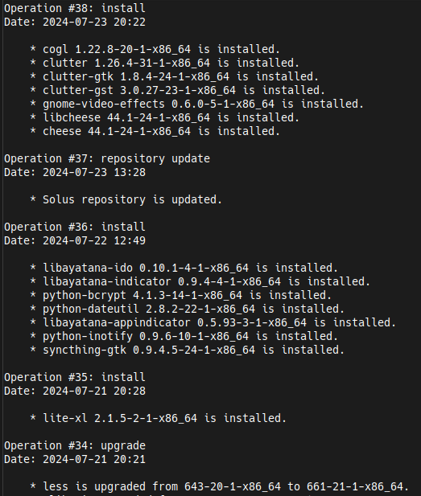

# History and software rollback in Solus

Solus offers a feature to view your history of software changes and revert your system to previous versions. 

You can use this feature if you have issues after installing packages or system updates, and you need to return to a working state.

## History of software changes

- To see your history of software changes, open a terminal and execute:

    ```bash
    eopkg history
    ```

    The terminal displays a list of all the software changes in your system.

    

## Rollback

:::warning[Important]

Reverting software changes works if either:

- The Solus repository has the version of the package you need, or
- You have a local copy of the package.

:::

1. Disable any [local repository](https://help.getsol.us/docs/packaging/advanced-config/local-repository#disabling-the-local-solbuild-repository-in-eopkg) you have.

    Local repositories can cause errors during rollbacks.

1. Open a terminal.

1. View the history of software changes:

    ```bash
    sudo eopkg history
    ```

1. Note the number of the most recent software change.

1. Go back to the desired state:

    ```bash
    sudo eopkg history -t NUMBER
    ```

    Replace `NUMBER` with a number lower than the latest software change.

    For example, if you want to revert operation 100, use 99 as the number.

After reverting to the desired state, verify your system status. You might need to restart your system to see some of the changes.