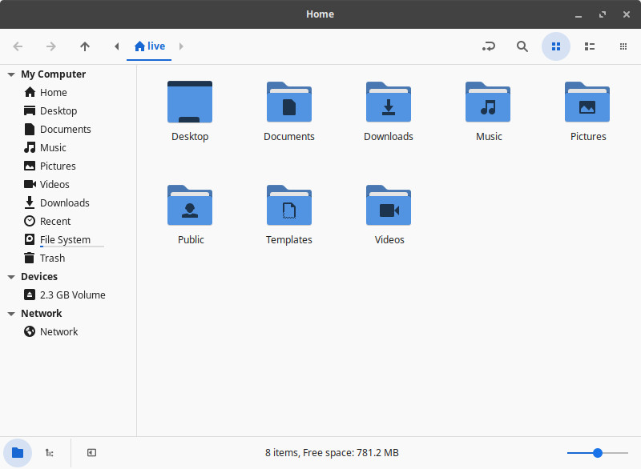
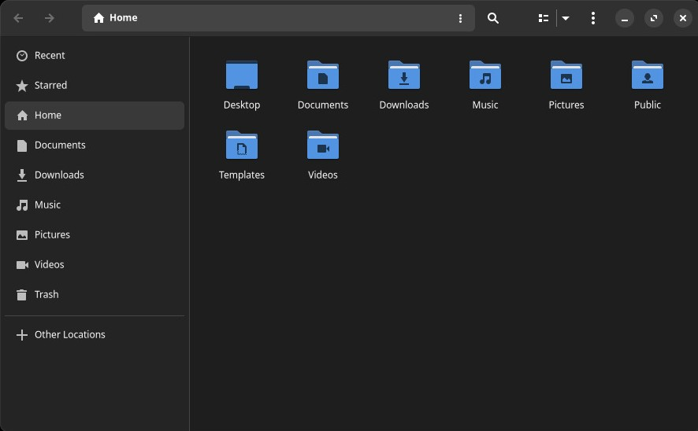
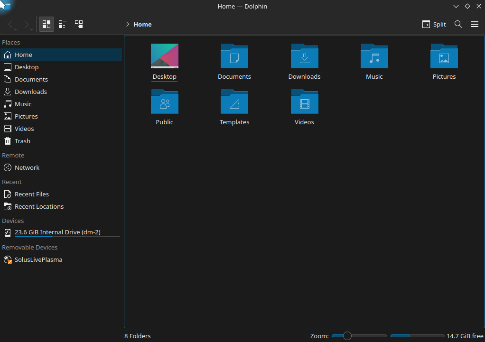
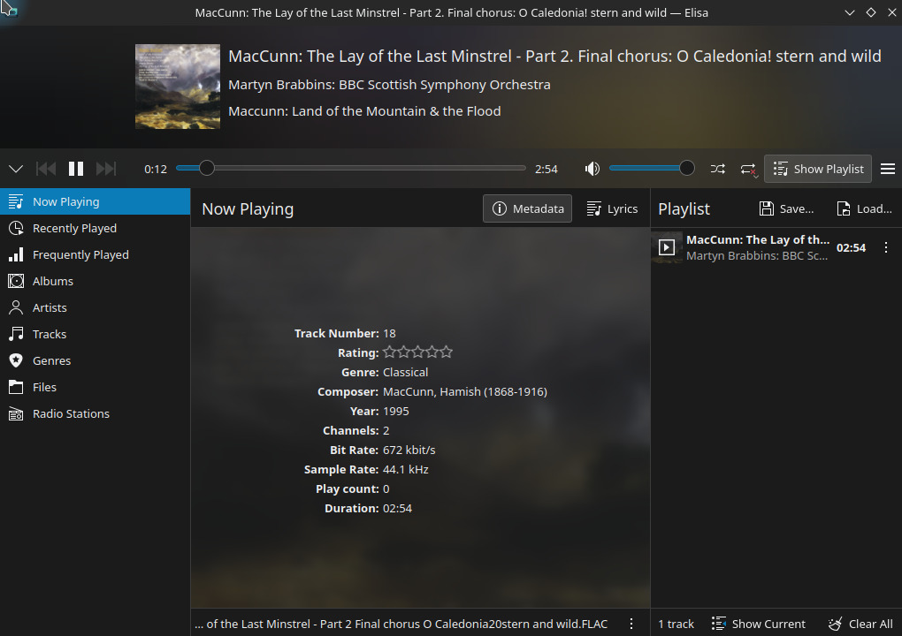
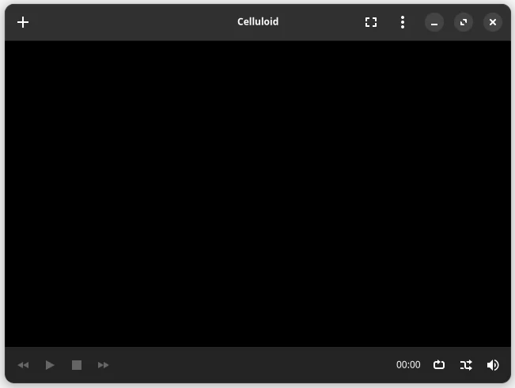
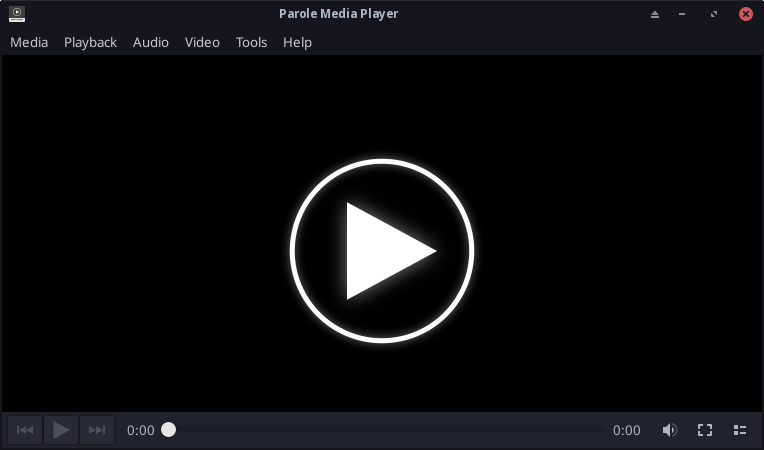

# Default Applications

Each version of Solus comes with a pre-installed collection of desktop applications that can help you perform common tasks.

# Web Browser

Solus comes pre-installed with Firefox, a secure and trustworthy web browser provided by the non-profit organization [Mozilla](https://www.mozilla.org/).

# Email Client

Solus comes pre-installed with the powerful [Thunderbird](https://www.thunderbird.net/) email, newsgroup, and feeds client.

# Managing Your Files

Each Linux desktop environment has its own graphical application for managing files:

| Desktop | Application                     |
| ------- | ------------------------------- |
| Budgie  | Nemo                            |
| GNOME   | GNOME Files (formerly Nautilus) |
| Plasma  | Dolphin                         |
| XFCE    | Nemo                            |

## Nemo

## GNOME Files

## Dolphin

# Office Suite

Solus comes pre-installed with [LibreOffice](https://www.libreoffice.org), an office suite that is capable of replacing MicrosoftTM Office for the most common tasks.

By default, Solus provides Writer (document editor), Calc (spreadsheet editor), and Impress (presentation editor). Other applications such as Math or Draw can be installed from the Software Center.

| LibreOffice | Microsoft Office Equivalent | Apple Equivalent |
| ----------- | --------------------------- | ---------------- |
| Writer      | Word                        | Pages            |
| Calc        | Excel                       | Numbers          |
| Impress     | PowerPoint                  | Keynote          |
| Draw        | Visio                       |                  |
| Math        |                             |                  |

## Calc

Calc is a spreadsheet editor. You can view, create, and edit spreadsheets as well as leverage a comprehensive range of advanced functions. Calc supports a variety of common open formats and MicrosoftTM Office compatible document formats such as (but not limited to): `xls`, `xlsx`, and `ods`.

## Draw

Draw is a graphical editor that allows you to sketch diagrams, workflows and any kind of other simple to complex drawing you can imagine. You can install Draw from the Software Center by searching for the package `libreoffice-draw`.

## Impress

Impress is a presentation viewer and editor. You can view, create, edit, and export presentations in common open formats or MicrosoftTM Office compatible document formats such as (but not limited to): `ppt`, `pptx`, and `odp`.

## Math

Math is a formula editor. Create your mathematical and scientific expressions and insert them with the correct formatting into your text documents, spreadsheets, presentations, or drawings. Math can be installed from the Software Center by searching for the package `libreoffice-math`.

## Writer

Writer is a document editor. You can view, create, edit, and export documents in common open formats or MicrosoftTM Office compatible document formats such as (but not limited to): `doc`, `docx`, and `odt`.

## Spell-checking

LibreOffice Writer users may want to install the package `libreoffice-common-dictionaries` from Software Center to automatically enable spell-checking support.

### Finnish

Finnish language support is provided by installing `libreoffice-voikko`. After installation of this package, there is further configuration required to properly leverage the Voikko spell-checking and Finnish dictionary support.

1. Open up LibreOffice Writer
2. In the menubar, go to `Tools` then `Options`. This will open up the Options dialog.
3. Go to the Language Settings, listed on the left of Options.
4. Under Language Settings, click Writing Aids and ensure the "Spellchecker (Voikko)", "Grammar checker (Voikko)", and "Hyphenator (Voikko)" are under the "Available language modules" section.
5. Under Language Settings, click Voikko and ensure "standard: suomi (perussanasto)" is selected under the "Vocabulary" section.

# Music

| Desktop | Application |
| ------- | ----------- |
| Budgie  | Rhythmbox   |
| GNOME   | Rhythmbox   |
| Plasma  | Elisa       |
| XFCE    | Rhythmbox   |

## Rhythmbox

## Elisa

# Video

| Desktop | Application                    |
| ------- | ------------------------------ |
| Budgie  | Celluloid (formerly GNOME MPV) |
| GNOME   | Celluloid (formerly GNOME MPV) |
| Plasma  | Haruna                         |
| XFCE    | Parole                         |

## Celluloid

## Haruna

## Parole

