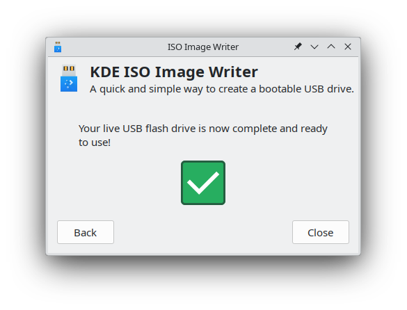

# Preparing to install

Before you start, make sure your system meets the [minimum requirements](system-requirements.md).

The first step to installing Solus is getting the correct media. The Solus Project provides ISO images, which contain the contents of Solus for installing.

## Getting the ISO

Download a Solus ISO by going to our [Download page](https://getsol.us/download) and picking an edition.

## Verifying the ISO

### Linux and macOS

Download the SHA256SUMS files for your chosen ISO edition: _File_, _Signed File_ and _Public Key_ from the links next to the _Download_ buttons on our [Download page](https://getsol.us/download).

**Note:** You should download all these files to the same directory.

#### Verifying the SHA256SUMS file signature

Import the Solus public key:

```bash
cd ~/path/to/download/directory
gpg --import solus-releng-pub.gpg
```

Verify the signed checksum file:

```bash
gpg --verify Solus-Budgie-Release-2024-10-14.iso.sha256sum.sign Solus-Budgie-Release-2024-10-14.iso.sha256sum
```

#### Verifying the ISO checksum

Check that the computed hash of the downloaded ISO file matches the hash supplied by Solus:

```bash
sha256sum -c Solus-Budgie-Release-2024-10-14.iso.sha256sum | grep OK
```

### Windows

#### Verifying signed SHA256SUM file

On Windows, first install [Gpg4win](https://www.gpg4win.org/).

Now you can run the same `gpg` commands from the the [_Verifyng the SHA256SUMS file signature_](/docs/user/quick-start/installation/index.md#verifying-the-sha256sums-file-signature) section above.

#### Verifying the ISO checksum

Launch powershell and compute the hash of the ISO file you just downloaded. You will have to manually compare the result to the hash in the SHA256SUMS file.

```powershell
Get-FileHash C:\path\to\Solus-Budgie-Release-2024-10-14.iso
cat C:\path\to\Solus-Budgie-Release-2024-10-14.iso.sha256sum
```

Alternatively, you can use a graphical program that can calculate SHA256 hashes like _Rufus_ or _7-Zip_.

## Creating bootable media

To make boot media, you will need:

1. Either a blank DVD or a USB drive larger than 2 GB.
2. If using a USB, the ability to boot from the USB.
3. ISO file from the [Getting the ISO](#getting-the-iso) section.

There are many tools which can write our ISO image to DVDs or USB thumb drives. Chose from an option below.

### Linux

#### DVD

We recommend using [Brasero](https://wiki.gnome.org/Apps/Brasero) for writing the ISO to a DVD.

1. Insert blank DVD (DVD-R or DVD+RW is suitable) into your DVD writer.
2. Open Brasero.
3. Select the option “Burn image”.
4. Click the “Click here to select a disc image” button and using the file dialog, choose the ISO.
5. Ensure the correct DVD is selected in the “Select a disc to write to”.
6. Click "Burn" and wait.
7. Upon seeing “Image successfully burned to DVD”, click "Close".

#### USB

We recommend using [GNOME MultiWriter](https://wiki.gnome.org/Apps/MultiWriter) or [ISO Image Writer](https://apps.kde.org/isoimagewriter/) for KDE. Please note that UNetbootin will **not** work.

##### GNOME MultiWriter

Upon opening GNOME MultiWriter, you will likely be shown a window similar to the one below, if your USB drive is already plugged in and mounted.

:::warning

The ISO image will be written to _all mounted USB drives_. Ensure that the only USB drive that is connected is the one you wish to write the ISO to.

:::


If your USB drive is not mounted, you will be prompted with an image indicating to plug it in.

Next, click the "Start Copying" button, and you will be prompted to select the ISO. Choose the ISO you downloaded in the "Getting the ISO" section. The USB will automatically be written to.


Upon completion, you will be prompted with the following dialog and your USB is now ready for use.


#### KDE ISO Image Writer

:::info

You will need both the ISO and sha256sums file for it saved in the same directory.

:::

When you open ISO Image Writer, you will see a window similar to the one below, if your USB drive is already plugged in and mounted.


If there is no USB drive mounted, the USB drive field will be greyed out. Simply plug in the USB drive you want to use for the ISO, it will be auto-detected.

Click on the top field "Write this ISO image:". Select the ISO image you downloaded in the "Getting the ISO" section.

You may see "Downloading ISO image". When this is done, click the Create button.


When the operation is finished, you will see the confirmation dialog. Your USB is now ready for use.



##### Command-line

For those comfortable with the command-line / terminal, we will walk you through using `dd`.

First, insert the USB drive into your computer and open your Terminal. Proceed to type `lsblk` into your Terminal. It should output something along the lines of:

```bash
NAME   MAJ:MIN RM   SIZE RO TYPE MOUNTPOINT
sda      8:0    0 111.8G  0 disk
├─sda1   8:1    0   350M  0 part
├─sda2   8:2    0  39.7G  0 part
└─sda3   8:3    0  71.8G  0 part /
sdb      8:64   1   7.5G  0 disk
├─sdb1   8:65   1   712M  0 part
└─sdb2   8:66   1  17.2M  0 part
```

You will see one disk, in this case `/dev/sdb`, that is roughly the size of the USB drive. Yours should be similar (difference being in size). Write this device down somewhere.

Next, locate the downloaded ISO. It will most likely be in your Downloads folder. In the event that it is, type: `cd ~/Downloads`

If it is **not** in your Downloads folder, use `cd` to navigate to the correct directory.

:::danger

This is where we overwrite the contents of your USB drive so please ensure you identified the correct drive in the `lsblk` stage above. Selecting the wrong drive here will lead to its contents being overwritten. An example command is below, however you may need to replace `sdb` with the drive we located above:

:::

```bash
sudo dd if=Solus-Budgie-Release-2024-10-14.iso of=/dev/sdb bs=4M status=progress oflag=sync && sudo eject /dev/sdb
```

This will write the contents of the ISO to the thumb drive so you can boot it and also make sure the data is synchronized so you can eject the USB safely.

### Windows

#### DVD

You can easily burn an ISO image to a DVD, on Windows 7 and newer, by using Window's built-in file manager (Explorer).

1. Open Windows' built-in file manager (Explorer).
2. Right click on the ISO image file and click "Burn disk image".
3. Select the correct disc burner.
4. Click "Burn".

#### USB

You can easily burn an ISO image to a USB by using graphical tool [Rufus](https://rufus.ie/).

1. Open Rufus.
2. Ensure your device is correct by checking the contents of the Device dropdown.
3. Click the CD icon found in the image below, and select the ISO.
4. Untick all options except "Create a bootable disk using" and use the dropdown to select "DD Image".
5. Click "Start".


### macOS

#### DVD

Since OS X El Capitan (10.11), the easiest way to burn a DVD is:

1. Insert your DVD and open Finder.
2. Right click on the ISO image.
3. Click on “Burn Disk Image ‘Solus-Budgie-Release-2024-10-14.iso’ to Disc…”
4. Then click “Burn”.


#### USB

##### Graphical tool

One of the easiest ways to burn an ISO image to a USB thumb drive is by using a graphical tool called [Etcher](https://etcher.balena.io/).

1. Open Etcher.
2. Click on “Select image” and then select the ISO and click “Open”.
3. Etcher will automatically select your USB drive. If it has selected the wrong one, click “Change” and select the correct one.
4. Click “Flash!”.
5. You may be prompted for your macOS user password.
6. Once Etcher has finished it is safe to remove the USB drive.

You may see a message stating “The disk you inserted was not readable by this computer.” once Etcher finishes. This can be ignored.


##### Command-line

For those comfortable with the macOS Terminal app, we will walk you through using `dd`.

First, insert the USB drive into your computer and open Terminal (found in Applications/Utilities).

Now you'll need to identify your USB drive by listing your storage devices with the following command:

```bash
diskutil list
```

You should see output similar to this:

```bash
/dev/disk0 (internal, physical):
   #:                       TYPE NAME                    SIZE       IDENTIFIER
   0:      GUID_partition_scheme                        *1.0 TB     disk0
   1:                        EFI EFI                     209.7 MB   disk0s1
   2:                  Apple_HFS Macintosh HD            999.3 GB   disk0s2
   3:                 Apple_Boot Recovery HD             650.0 MB   disk0s3

/dev/disk1 (external, physical):
   #:                       TYPE NAME                    SIZE       IDENTIFIER
   0:      GUID_partition_scheme                        *15.6 GB    disk1
   1:                        EFI EFI                     209.7 MB   disk1s1
   2:                  Apple_HFS Ultra                   15.3 GB    disk1s2
```

From this output, we can see the USB drive is listed as `/dev/disk1 (external, physical)`. In this example, the IDENTIFIER is `disk1`. Please note, your USB drive may have a different identifier. You should be able to tell which is your USB drive by checking the name and size.

macOS usually auto-mounts USB drives so you’ll need to unmount it first before proceeding. Use the following command and replace `IDENTIFIER` with the correct identifier we found in the `diskutil list` step.

```bash
diskutil unmountDisk /dev/IDENTIFIER
```

Now navigate to the folder that has the downloaded ISO. This could be your Mac’s Downloads folder. The following command will get you there:

```bash
cd ~/Downloads
```

:::danger

**This next step is dangerous. Using the wrong drive identifier could result in data loss.**

:::

We will use the `dd` command to write the contents of the ISO to the thumb drive. Replace `IDENTIFIER` in the command below with your drive identifier. Note the extra `r` before the identifier (i.e `rdisk1`). This is for raw mode, which along with bs=1m, makes the transfer faster.

```bash
sudo dd if=Solus-Budgie-Release-2024-10-14.iso of=/dev/rIDENTIFIER bs=1m
```

Be patient! After a few minutes you’ll receive a message saying how much data was transferred. You can now safely eject the usb drive.

```bash
diskutil eject /dev/IDENTIFIER
```

## Boot the media

Now it is time to restart your computer to boot the DVD or USB. Most computers will automatically boot from DVDs and USB, however if you experience issues booting the media, you may need to select to boot from DVD or USB.

This is usually accessible by pressing `F9` or `F12` while your computer is booting. On some devices it may also be `ESC`.

Macs will boot to the "Startup Manager" by holding down the Option (Alt) key. The DVD or USB drive will most likely show up as "EFI Boot".
