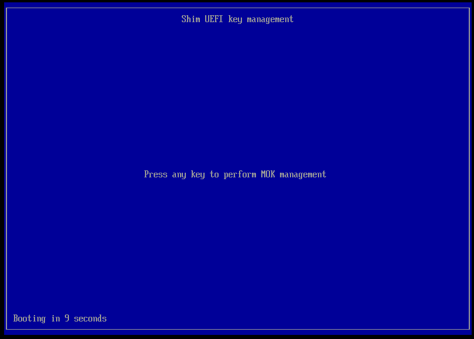
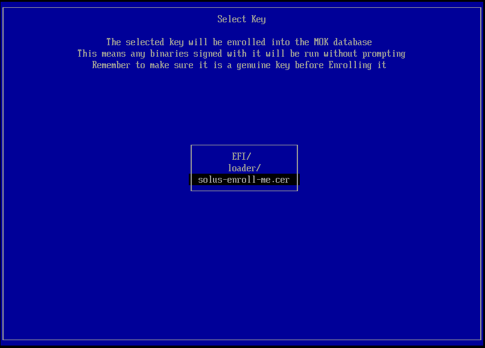
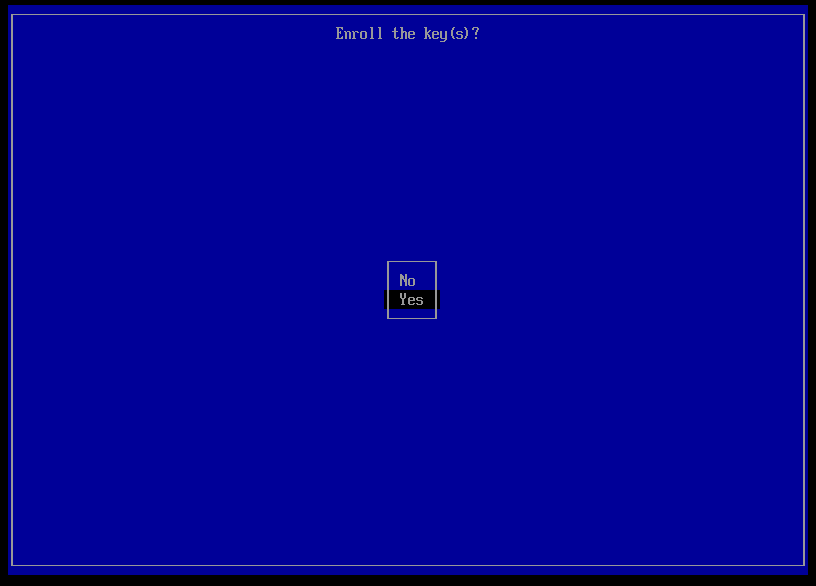
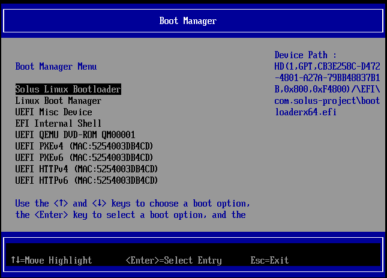

# Booting with Secure Boot Enabled

Since Solus 4.4 secure boot is now supported. When you first boot the ISO, and, if you have secure boot enabled in your UEFI firmware; you will have to perform the one-time-step of manually enrolling the Solus certificate. The following guide will walk you through this. If you already have Solus installed and wish to enable secure boot, skip ahead [here](#enabling-secure-boot-on-an-existing-install).

<em>Note that this only applies to machines with UEFI firmware, if your machine uses the older BIOS firmware you can safely ignore this article. If you wish to avoid having to do this step then you may disable secure boot in your machine's UEFI firmware interface.</em>

## Enrolling the Solus certificate

After [booting](/docs/user/quick-start/installation/#boot-the-media) the ISO from USB/DVD and, if Secure Boot is enabled in your device's UEFI firmware. A warning will appear concerning a secure boot violation, press `Enter` on your keyboard to continue.

Now, it will provide 10 seconds in order to continue to MOK (Machine Owner Key) Management, press `Enter` again within the timeframe to do so.

Use the down `↓` arrow key on your keyboard to select `Enroll Key from Disk` and press `Enter` to continue.

Here you'll need to find the `solus-enroll-me.cer` certificate, it should normally be located in the `SOLUSESP` directory. Use the arrow keys to select a directory, `Enter` to enter it and `Esc` to go back.

Once you found the `solus-enroll-me.cer` certificate, press `Enter` to enroll it, and press the `↓` and `Enter` key to continue. Finally, when confirming you wish to Enroll the key(s) press the `↓` key to select "Yes" and `Enter` again.

Now, with the Solus certificate enrolled, press `Enter` to reboot the machine, boot the ISO from USB/DVD again and it should continue booting to the installer.

<em>Once Solus is installed you will not have to enroll the certificate again as it will stay enrolled.</em>

## Enabling Secure Boot on an existing install

If you already have Solus installed and wish to enable secure boot then there is one extra step you must perform BEFORE continuing with [Enrolling the Solus Certificate](#enrolling-the-solus-certificate) as normal.

Firstly, you must confirm you have `clr-boot-manager, version: 3.2.12, release: 29` (or later) installed, run `eopkg info clr-boot-manager` to confirm this. This version of `clr-boot-manager` will have created a new UEFI boot entry on your machine called `Solus Linux Bootloader` that can be booted from with Secure Boot enabled.

:::note Before continuing, it is important to note the screenshots provided here are for example only, your UEFI firmware interface will almost certainly look different.
:::

Reboot your machine and select the appropriate keyboard button during startup to choose a boot device. The correct key will vary from machine to machine but some common keys are `F2`, `F11`, `F12`, or `Esc`. From the boot selection interface, select the `Solus Linux Bootloader` entry and boot from it. If you've manage to successfully boot then you can continue with enabling Secure Boot.

<em>If there is no entry called `Solus Linux Bootloader`, reboot, log back in, open a terminal and run `sudo clr-boot-manager update`.</em>

After successfully booting from the new `Solus Linux Bootloader` UEFI entry, open a terminal, input `systemctl reboot --firmware-setup` and press `Enter`. This will reboot you into your machine's UEFI firmware interface. Once there, you will have to find and enable the secure boot setting. Where this is located varies from machine to machine. Some common places it can be located under are `Windows OS Configuration`, `Security` or `Device Manager`.

Once you've found and enabled the Secure Boot setting then reboot once again from the `Solus Linux Bootloader` UEFI entry. From there you can continue with the instructions: [Enrolling the Solus Certificate](#enrolling-the-solus-certificate), bearing in mind you are booting from a disk rather than from a USB/DVD.

<em> Remember to save settings after enabling Secure Boot! (usually `F10`)</em>

### Final tips

Once you've successfully enabled and booted your Solus install with Secure Boot enabled. Go back into your machine's UEFI firmware interface and change the default boot device to `Solus Linux Bootloader`.

You can run `bootctl status | grep "Secure Boot"` in a terminal to verify Secure Boot is enabled.

It is possible to delete the old Solus UEFI boot entry with `efibootmgr` once secure boot is enabled successfully, However, caution is required and as such, instructions to do so are not provided here.

# Why is enrolling the Solus certificate necessary?

In order to avoid the one time step of enrolling the Solus certificate, Solus would have to get it's own `shim` EFI executable signed by Microsoft. Currently, the following actions must be completed to do this:

- Obtain an EV Certificate (expensive!)
- Register for the Microsoft Windows Hardware Developer Program.
- Implement any additional security requirements as required by the [shim-review](https://github.com/rhboot/shim-review/) process.

Currently, we are using a third-party `shim` that is already signed by Microsoft, the downside is the Solus (vendor) certificate is not already embedded and trusted in the `shim` executable, and as such, requires the user to enroll the Solus certificate manually on first boot.

We appreciate that having the enroll the certificate may be confusing to users and, the process to do so may not be self-explanatory. Especially, as Secure Boot is generally enabled by default for the majority of machines.

However, it is also important to consider the following:

- Obtaining an EV certificate is an expensive investment.
- Enrolling the Solus certificate is only required once, and, only if secure boot is enabled.

As such, we are not currently looking to our get our own `shim` signed by Microsoft. However, thanks to our supporters on [OpenCollective](https://opencollective.com/getsolus), it is indeed within our budget to obtain an EV certificate in the future which would unblock the additional requirements.

## Useful links for additional reading

- https://learn.microsoft.com/windows-hardware/drivers/dashboard/file-signing-reqs
- https://github.com/rhboot/shim-review/
- https://github.com/rhboot/shim/
