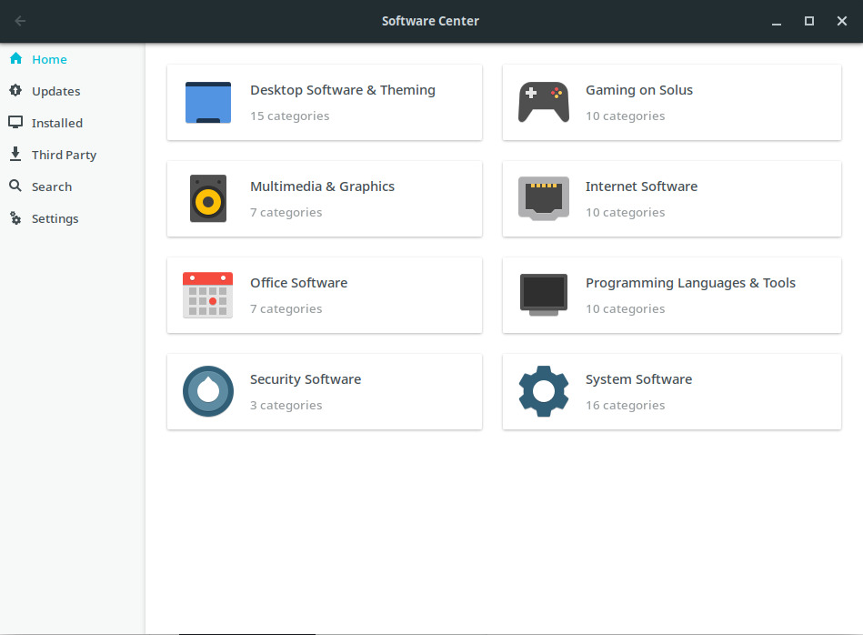

# Software Center

You can install software ranging from Google Chrome to LibreOffice, as well as update software, via our Software Center.

Solus uses the `eopkg` package manager, which is not compatible with either `deb` or `rpm` packages offered by other Linux-based operating systems.
For information on how to use eopkg directly, see the [Package Management section](/docs/category/package-management/)

You can also use a number of distribution-agnostic (or "universal") package managers to install applications, including Flatpak and AppImage.
