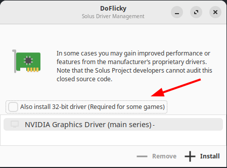

# Steam

- To install `steam`, use the Software Center or execute the following command:

  ```bash
  sudo eopkg install steam
  ```

  Steam is also available on Flathub.

## Running steam games with Nvidia graphics cards

If your system has an Nvidia graphics card, install the 32-bit version of the driver using the hardware drivers utility:

1. Open **Hardware Drivers** (DoFlicky).
2. Select **Also install 32-bit driver**:

   

3. Select the driver of your Nvidia graphics card.
4. Click **Install**.
