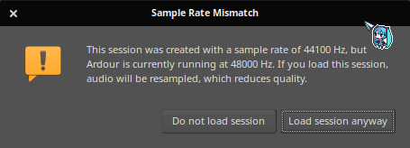
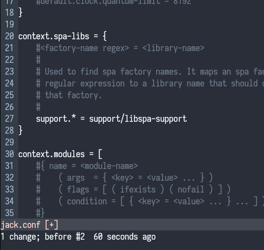
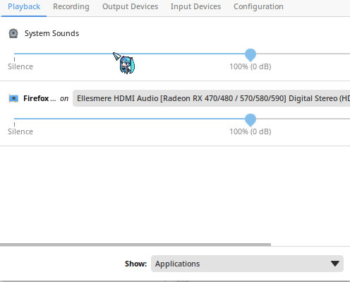
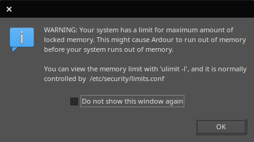

# Sound

Solus comes with Pipewire configured by default.

## Pipewire as a JACK Replacement

Firstly, install `pipewire-jack`

```bash
sudo eopkg it pipewire-jack
```

Currently, using `pipewire-jack` as a `JACK` replacement is not as smooth as one would think. One must get their hands dirty a little to get JACK apps to behave appropriately 🛠

### Issues to be fixed

With no configuration pipewire will not be able to switch to the appropriate sample-rate for the project.



### Configuration

Fortunately both the `pipewire` and `pipewire-jack` packages come with the configs we need.

Open up your terminal of choice and input the commands below

```bash
cd .config/
mkdir -p pipewire/pipewire.conf.d/
sudo cp /usr/share/pipewire/pipewire.conf.avail/10-rates.conf pipewire/pipewire.conf.d/
sudo cp /usr/share/pipewire/jack.conf pipewire/
sudo chown yourUserName:yourUserName pipewire/jack.conf pipewire/pipewire.conf.d/10-rates.conf
```

Now open the `jack.conf` in your text editor and

1. Search for `node.rate`
2. Uncomment `node.rate`
3. Input the sample-rate you wish JACK applications to open with after the `1/`
   - common rates: 44100 48000 88200 96000

**Without this `Pipewire` wont dynamically adjust the sample-rate for you whenever a `JACK` application opens**



Now reboot your system.

:::note
After applying the configuration above there **WILL** be a delay of up to 2 seconds when beginning to play audio. This is due to the 10-rates.conf that allows `Pipewire` to dynamically change sample-rates. Although, once the sample-rate is set everything is instant.
:::

### Not Done Yet

Lastly, we need to enable the `Pro Audio` sound configuration for our card. Not doing so will result in terrible Xruns (pops and crackles) even with all applied configuration.

**On Budgie**: `pavucontrol` is required to get access to the `Pro Audio` config. So install it

```bash
sudo eopkg it pavucontrol
```

Now open the program, switch over to the `Configuration` tab and select the `Pro Audio` option from the dropdown menu for your card



**On KDE**: everything you need is in the `Audio` section of system settings. Simply choose from the dropdown same as above.

**All is done! Happy audio production!!** 🥰

### Limits

If this is annoying you



You can adjust it by configuring the `limits.conf`. In this case we'll be using the `limits.d` for simplicity.

Input the commands below

```bash
sudo mkdir -p /etc/security/limits.d/
echo "@audio   -  memlock    unlimited" | sudo tee -a /etc/security/limits.d/audio.conf
```

**On Budgie**: Log out and log back in for changes to take effect

**On KDE**: Reboot the system
